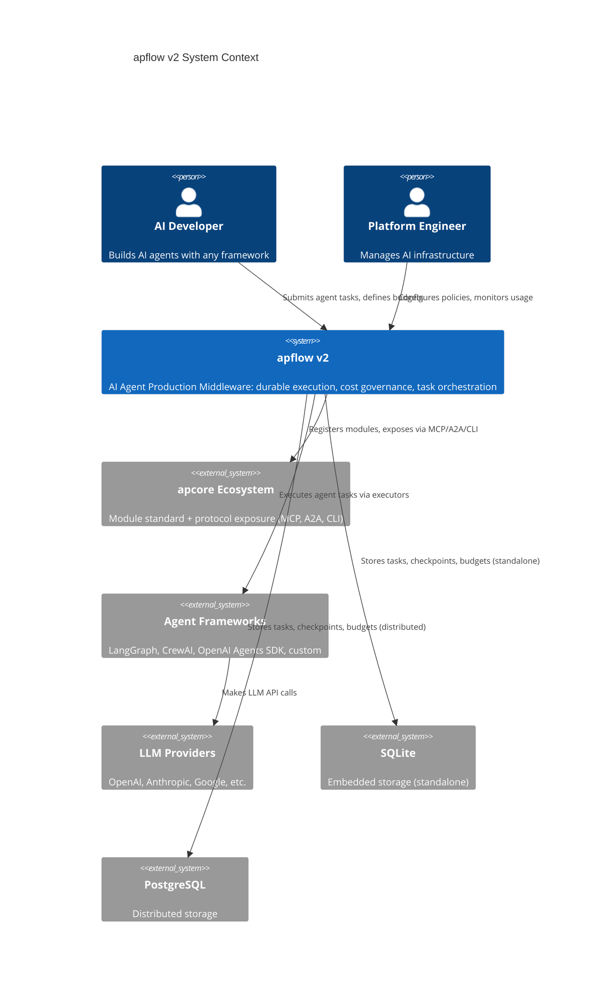
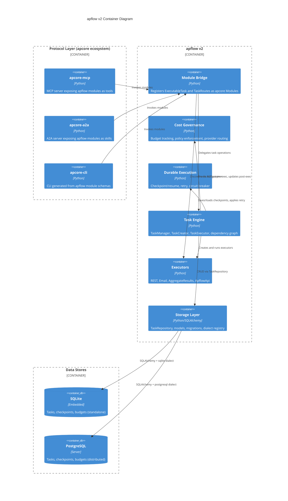
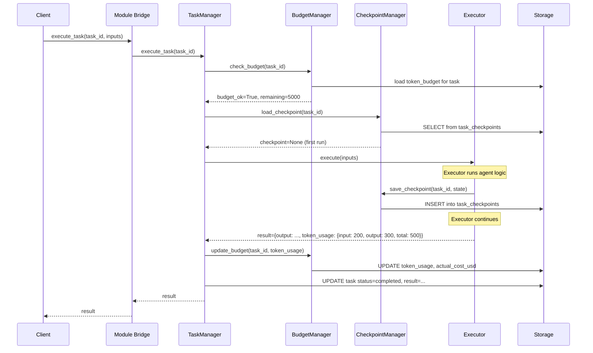
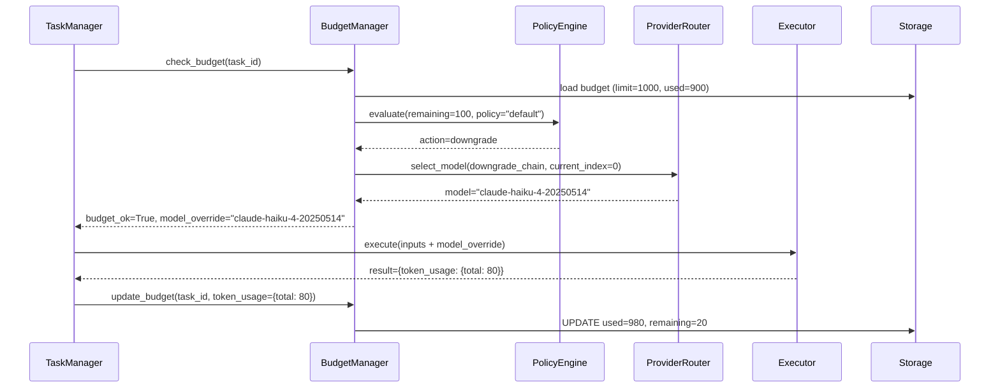
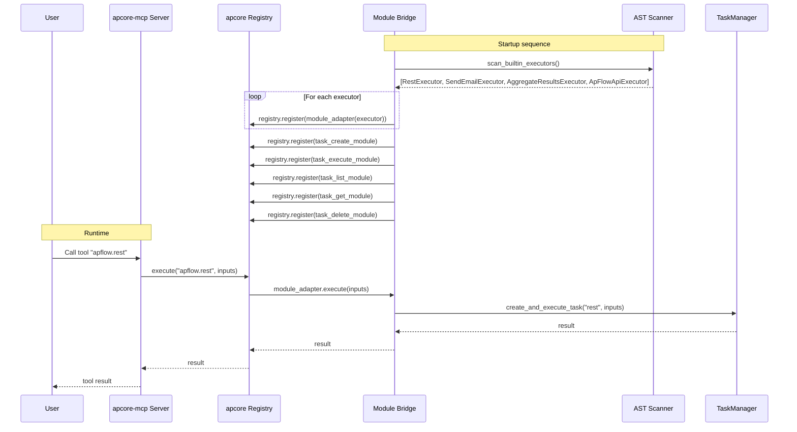

# apflow v2 -- Technical Design Document

> **Positioning Update:** The product has been repositioned from "AI Agent Production Middleware"
> to **"AI-Perceivable Distributed Orchestration"** (AP+Flow). See README.md for current positioning.

**Product:** apflow v2 -- AI-Perceivable Distributed Orchestration
**Version:** 0.20.0 (MVP)
**Author:** apflow team
**Date:** 2026-03-28
**Status:** Draft
**PRD Reference:** `docs/prd.md`

---

## 1. Overview

### Problem

AI agents built with LangGraph, CrewAI, OpenAI Agents SDK, and similar frameworks lack production-grade infrastructure. Durable execution (checkpoint/resume), cost governance (token budgets, model downgrade), and multi-protocol exposure (MCP, A2A) require significant custom engineering that is framework-locked. apflow v1 attempted to solve this but carries 17,500 lines of self-built protocol and CLI code that duplicates what the apcore ecosystem already provides.

### Solution

apflow v2 repositions as framework-agnostic production middleware. It:

1. **Removes** all self-built protocol layers, CLI, and out-of-scope extensions (17,561 lines, 64 files) -- replaced by the apcore ecosystem.
2. **Adds** a bridge layer that registers apflow capabilities as apcore Modules, gaining automatic MCP, A2A, and CLI exposure.
3. **Adds** durable execution (checkpoint/resume, retry with backoff, circuit breaker) for long-running agent tasks.
4. **Adds** cost governance (token budgets, cost policies, model downgrade chains, usage reporting).
5. **Replaces** DuckDB with SQLite as the default embedded storage engine.
6. **Relaxes** TaskCreator to allow multi-root task forests.

### Scope

This document covers all P0 features (F-001 through F-005) plus the DuckDB-to-SQLite storage migration. P1 features (agent adapters, observability) and P2 features (advanced cost strategies, multi-agent coordination) are out of scope.

### Key Design Decisions Summary

| Decision | Choice | Rationale |
|---|---|---|
| Embedded DB engine | SQLite (replacing DuckDB) | Python stdlib, no `duckdb-engine` dep, WAL mode for concurrent reads |
| Checkpoint storage | Separate `task_checkpoints` table | Allows large checkpoints, independent lifecycle, no bloat on task queries |
| apcore registration | Auto-scan via existing AST scanner | Zero-config, reuses proven infrastructure |
| Token usage source | Executor reports via `execute()` return dict | Framework-agnostic, no LiteLLM dependency |
| Budget enforcement | Pre-check + post-update in TaskManager | Single integration point, thread-safe |
| Task tree constraint | Multi-root forests allowed | Removes artificial limitation, enables independent task workflows |

---

## 2. Design Goals & Non-Goals

### Goals

1. **Framework-agnostic durability:** Checkpoint/resume that works with any executor, not locked to a specific agent framework.
2. **Cost governance:** Token budgets and policy enforcement that operate at the task orchestration layer, independent of LLM provider.
3. **apcore integration:** Register all apflow capabilities as apcore Modules so that MCP, A2A, and CLI exposure is automatic and zero-maintenance.
4. **SQLite migration:** Replace DuckDB with SQLite to eliminate the `duckdb-engine` dependency and use Python's built-in SQLite support.
5. **Codebase reduction:** Remove 17,561 lines of code that duplicates apcore ecosystem functionality.
6. **Backward compatibility:** Preserved modules (core execution, storage, extensions) continue to work without breaking changes to their public APIs.

### Non-Goals

1. **Agent framework:** apflow does not build agents. Use LangGraph, CrewAI, OpenAI Agents SDK, or any other framework.
2. **UI/Dashboard:** No built-in user interface. Use apcore-mcp Tool Explorer or external tools for visualization.
3. **Observability platform:** No built-in tracing or monitoring. Langfuse and OpenTelemetry integration is deferred to P1 (F-008).
4. **LLM routing:** No built-in LLM API routing. Use LiteLLM, Portkey, or Bifrost for multi-provider routing.
5. **Cloud vendor dependency:** No AWS/GCP/Azure-specific code. Standalone SQLite for local, PostgreSQL for distributed.
6. **Agent adapters:** Framework-specific adapters (LangGraph, CrewAI, OpenAI) are deferred to P1 (F-006).

---

## 3. High-Level Architecture

### C4 Context Diagram



### C4 Container Diagram



### 4-Layer Architecture

```
Layer 4: Protocol Exposure (apcore ecosystem -- NOT built by apflow)
  +-------------------+-------------------+-------------------+
  | apcore-mcp        | apcore-a2a        | apcore-cli        |
  | MCP Server        | A2A Server        | CLI Generator     |
  | (streamable-http, | (Agent Card,      | (shell complete,  |
  |  stdio, SSE)      |  skills, stream)  |  man pages, audit)|
  +-------------------+-------------------+-------------------+
                              |
Layer 3: Module Standard (apcore -- NOT built by apflow)
  +-----------------------------------------------------------+
  | APCore Client | Registry | Executor | Module duck-type    |
  | @client.module | ACL | Middleware pipeline | Annotations   |
  +-----------------------------------------------------------+
                              |
Layer 2: apflow v2 (THIS PRODUCT)
  +-------------------+-------------------+-------------------+
  | Module Bridge     | Cost Governance   | Durable Execution |
  | (bridge/)         | (governance/)     | (durability/)     |
  +-------------------+-------------------+-------------------+
  | Task Orchestration Engine                                 |
  | TaskManager | TaskCreator | TaskExecutor                  |
  +-----------------------------------------------------------+
  | Executors (REST, Email, AggregateResults, ApflowApi)       |
  +-----------------------------------------------------------+
  | Storage (SQLite / PostgreSQL via SQLAlchemy dialects)      |
  +-----------------------------------------------------------+
                              |
Layer 1: Agent Frameworks (USER'S CHOICE -- not built by apflow)
  +-------------+-----------+------------+--------------------+
  | LangGraph   | CrewAI    | OpenAI     | Any async callable |
  +-------------+-----------+------------+--------------------+
```

### Data Flow: Task Execution with Checkpoint



### Data Flow: Cost-Governed Execution with Downgrade



### Data Flow: apcore Module Exposure



---

## 4. Detailed Design

### 4.1 Component: Storage Migration (DuckDB to SQLite)

#### Motivation

DuckDB requires the `duckdb-engine` third-party package. SQLite is part of Python's standard library and supported natively by SQLAlchemy. This migration eliminates a dependency, simplifies installation, and provides better compatibility across platforms.

#### New File: `src/apflow/core/storage/dialects/sqlite.py`

```python
"""SQLite dialect configuration (default, replacing DuckDB)"""

from typing import Dict, Any
from pathlib import Path
import json


class SQLiteDialect:
    """SQLite dialect configuration (default)

    Supports three connection modes:
    - Memory: sqlite:///:memory: (testing)
    - Shared memory: sqlite:///file:shared?mode=memory&cache=shared&uri=true (dev)
    - File with WAL: sqlite:///path/to/apflow.db (standalone production)
    """

    @staticmethod
    def normalize_data(data: Dict[str, Any]) -> Dict[str, Any]:
        """Normalize data before writing to database.

        SQLite stores JSON columns as TEXT. Nested dicts/lists
        must be serialized to JSON strings.
        """
        normalized: Dict[str, Any] = {}
        for key, value in data.items():
            if isinstance(value, (dict, list)):
                normalized[key] = json.dumps(value)
            else:
                normalized[key] = value
        return normalized

    @staticmethod
    def denormalize_data(data: Dict[str, Any]) -> Dict[str, Any]:
        """Denormalize data after reading from database.

        Attempts to parse JSON strings back to Python objects.
        """
        denormalized: Dict[str, Any] = {}
        for key, value in data.items():
            if isinstance(value, str):
                try:
                    denormalized[key] = json.loads(value)
                except (json.JSONDecodeError, TypeError):
                    denormalized[key] = value
            else:
                denormalized[key] = value
        return denormalized

    @staticmethod
    def get_connection_string(path: str = ":memory:") -> str:
        """Generate SQLite connection string.

        Args:
            path: One of:
                - ":memory:" for in-memory database (testing)
                - "file:shared?mode=memory&cache=shared&uri=true" for shared memory (dev)
                - "/path/to/apflow.db" for file-based (production)

        Returns:
            SQLAlchemy connection string.

        Raises:
            ValueError: If path is empty.
        """
        if not path:
            raise ValueError("SQLite path must not be empty. Use ':memory:' for in-memory mode.")

        if path == ":memory:":
            return "sqlite:///:memory:"
        elif "mode=memory" in path:
            return f"sqlite:///{path}"
        else:
            abs_path = str(Path(path).absolute())
            return f"sqlite:///{abs_path}"

    @staticmethod
    def get_engine_kwargs() -> Dict[str, Any]:
        """SQLite-specific engine parameters.

        Enables WAL mode for concurrent read access in file-based mode.
        StaticPool is not set here; the factory handles pool selection
        based on whether the connection is in-memory or file-based.
        """
        return {
            "pool_pre_ping": True,
        }

    @staticmethod
    def get_pragma_statements() -> list[str]:
        """SQLite PRAGMA statements for optimal performance.

        Applied after connection creation via event listener.
        """
        return [
            "PRAGMA journal_mode=WAL",
            "PRAGMA synchronous=NORMAL",
            "PRAGMA cache_size=-64000",  # 64MB cache
            "PRAGMA foreign_keys=ON",
            "PRAGMA busy_timeout=5000",  # 5 second busy timeout
        ]
```

#### Changes to `dialects/registry.py`

Replace DuckDB registration with SQLite:

```python
# Before (delete):
from apflow.core.storage.dialects.duckdb import DuckDBDialect
register_dialect("duckdb", DuckDBDialect)

# After (add):
from apflow.core.storage.dialects.sqlite import SQLiteDialect
register_dialect("sqlite", SQLiteDialect)
```

#### Changes to `storage/factory.py`

1. Replace all `duckdb` references with `sqlite`.
2. Default connection string changes from `duckdb:///:memory:` to `sqlite:///:memory:`.
3. Add SQLite PRAGMA execution via SQLAlchemy event listener:

```python
from sqlalchemy import event

def _apply_sqlite_pragmas(engine: Engine) -> None:
    """Apply SQLite PRAGMA statements for WAL mode and performance."""
    from apflow.core.storage.dialects.sqlite import SQLiteDialect

    if "sqlite" in str(engine.url):
        @event.listens_for(engine, "connect")
        def set_sqlite_pragma(dbapi_conn, connection_record):
            cursor = dbapi_conn.cursor()
            for pragma in SQLiteDialect.get_pragma_statements():
                cursor.execute(pragma)
            cursor.close()
```

#### Changes to `pyproject.toml`

```toml
# Remove from dependencies:
# "duckdb-engine>=0.10.0",
# "pytz>=2024.1",  # Was required for DuckDB timezone support

# SQLAlchemy's built-in SQLite support requires no additional packages.
```

#### Migration Compatibility

Existing migration files (001, 002, 003) use `information_schema.tables` queries that work with DuckDB and PostgreSQL but not with SQLite. Each migration must be updated to use SQLAlchemy `inspect()` or SQLite-compatible introspection:

```python
# Before (DuckDB/PostgreSQL specific):
result = conn.execute(text(
    f"SELECT COUNT(*) FROM information_schema.tables WHERE table_name = '{table_name}'"
))

# After (cross-dialect):
inspector = inspect(engine)
table_exists = table_name in inspector.get_table_names()
```

All three existing migrations (001, 002, 003) require this change. The pattern is consistent across all migration files.

#### Impact Summary

| File | Action | Description |
|---|---|---|
| `dialects/sqlite.py` | Create | New SQLite dialect (replaces `duckdb.py`) |
| `dialects/duckdb.py` | Delete | No longer needed |
| `dialects/registry.py` | Modify | Register `sqlite` instead of `duckdb` |
| `storage/factory.py` | Modify | Default to SQLite, add PRAGMA listener |
| `migrations/001_*.py` | Modify | Replace `information_schema` with `inspect()` |
| `migrations/002_*.py` | Modify | Replace `information_schema` with `inspect()` |
| `migrations/003_*.py` | Modify | Replace `information_schema` with `inspect()` |
| `pyproject.toml` | Modify | Remove `duckdb-engine`, `pytz` |

---

### 4.2 Component: Project Slimming (F-001)

#### Complete File Deletion List

**`api/a2a/` -- 7 files, ~1,840 lines (replaced by apcore-a2a):**
- `src/apflow/api/a2a/__init__.py`
- `src/apflow/api/a2a/agent.py`
- `src/apflow/api/a2a/config.py`
- `src/apflow/api/a2a/handler.py`
- `src/apflow/api/a2a/routes.py`
- `src/apflow/api/a2a/server.py`
- `src/apflow/api/a2a/task_store.py`

**`api/mcp/` -- 8 files, ~933 lines (replaced by apcore-mcp):**
- `src/apflow/api/mcp/__init__.py`
- `src/apflow/api/mcp/config.py`
- `src/apflow/api/mcp/handler.py`
- `src/apflow/api/mcp/resources.py`
- `src/apflow/api/mcp/routes.py`
- `src/apflow/api/mcp/server.py`
- `src/apflow/api/mcp/tools.py`
- `src/apflow/api/mcp/transport.py`

**`api/graphql/` -- 9 files, ~646 lines (dropped):**
- All files in `src/apflow/api/graphql/`

**`api/docs/` -- 3 files, ~727 lines (replaced by apcore-mcp Tool Explorer):**
- All files in `src/apflow/api/docs/`

**`api/` container files:**
- `src/apflow/api/__init__.py`
- `src/apflow/api/main.py`

**`cli/` -- 18 files, ~6,979 lines (replaced by apcore-cli):**
- All files in `src/apflow/cli/`

**`extensions/crewai/` -- 4 files, ~1,747 lines (future: thin adapter):**
- All files in `src/apflow/extensions/crewai/`

**`extensions/llm/` -- 2 files, ~251 lines (future: agent adapter):**
- All files in `src/apflow/extensions/llm/`

**`extensions/generate/` -- 8 files, ~3,651 lines (dropped):**
- All files in `src/apflow/extensions/generate/`

**`extensions/grpc/` -- 2 files, ~314 lines (dropped):**
- All files in `src/apflow/extensions/grpc/`

**`extensions/tools/` -- 3 files, ~473 lines (dropped):**
- All files in `src/apflow/extensions/tools/`

#### pyproject.toml Transformation

```toml
[project]
name = "apflow"
version = "0.20.0"
description = "AI Agent Production Middleware"
requires-python = ">=3.11"

# Core dependencies
dependencies = [
    "pydantic[email]>=2.0.0",
    "pydantic-settings>=2.0.0",
    "sqlalchemy>=2.0.0",
    "sqlalchemy-session-proxy>=0.1.0",
    "alembic>=1.13.0",
    # SQLite is Python stdlib -- no additional dependency
    "apcore>=0.14.0",
]

[project.optional-dependencies]
# Protocol exposure (all via apcore ecosystem)
mcp-server = ["apcore-mcp>=0.10.1"]
a2a-server = ["apcore-a2a"]
cli-gen = ["apcore-cli>=0.3.0"]

# Storage
postgres = [
    "asyncpg>=0.29.0",
    "psycopg2-binary>=2.9.9",
    "greenlet>=3.0.0",
]

# Executor-specific extras (preserved)
scheduling = ["croniter>=1.0.0"]
email = ["aiosmtplib>=3.0.0"]

# Documentation
docs = [
    "mkdocs>=1.6.0",
    "mkdocs-material>=9.5.0",
    "mkdocs-mermaid2-plugin>=1.0.0",
    "mkdocs-minify-plugin>=0.7.0",
    "pymdown-extensions>=10.0.0",
]

# Development
dev = [
    "pytest>=7.0.0",
    "pytest-asyncio>=0.21.0",
    "pytest-cov>=4.0.0",
    "pytest-timeout>=2.1.0",
    "black>=23.0.0",
    "ruff>=0.1.0",
    "mypy>=1.5.0",
    "build>=1.0.0",
    "twine>=4.0.0",
    "pre-commit>=3.0.0",
]

# Delete these extras entirely:
# a2a, cli, crewai, llm, grpc, graphql, tools, standard, all, llm-key-config, mcp

# Delete project.scripts entirely:
# [project.scripts] section removed -- no apflow or apflow-server entry points
```

#### `__init__.py` Updates

In `src/apflow/__init__.py`:

1. Update `__version__` from `"0.18.2"` to `"0.20.0"`.
2. Update module docstring to replace "Task Orchestration and Execution Framework" with "AI Agent Production Middleware".
3. Remove references to "CrewAI", "A2A Protocol Server", "CLI tools" from docstring.
4. Remove `"create_storage"` and `"get_default_storage"` from `__all__` (deprecated backward-compat).

#### Import Reference Cleanup

After deletion, grep the preserved codebase for any imports of deleted modules. Known references to clean:

| Pattern to Search | Expected Locations | Action |
|---|---|---|
| `from apflow.api` | Possibly in test files | Delete test files for deleted modules |
| `from apflow.cli` | Possibly in test files | Delete test files for deleted modules |
| `from apflow.extensions.crewai` | `core/execution/task_executor.py` lazy imports | Remove lazy import branch |
| `from apflow.extensions.llm` | Scanner cache, test files | Remove references |
| `from apflow.extensions.generate` | Scanner cache, test files | Remove references |
| `from apflow.extensions.grpc` | Scanner cache, test files | Remove references |
| `from apflow.extensions.tools` | Scanner cache, test files | Remove references |

#### Test Cleanup

Delete all test files that test deleted modules:

- `tests/api/` -- all tests for A2A, MCP, GraphQL, docs
- `tests/cli/` -- all CLI tests
- `tests/extensions/crewai/` -- all CrewAI tests
- `tests/extensions/llm/` -- all LLM tests
- `tests/extensions/generate/` -- all generate tests
- `tests/extensions/grpc/` -- all gRPC tests
- `tests/extensions/tools/` -- all tools tests

---

### 4.3 Component: apcore Module Bridge (F-002)

#### Module Structure

```
src/apflow/bridge/
    __init__.py
    module_adapter.py      # ExecutableTask -> apcore Module adapter
    scanner_bridge.py      # AST scanner -> apcore Registry auto-registration
    task_modules.py        # TaskRoutes handlers as apcore Modules
    registry_setup.py      # APCore client initialization and registration
```

#### `bridge/module_adapter.py`: ExecutableTask to apcore Module Adapter

```python
"""Adapt ExecutableTask instances to apcore Module interface."""

from typing import Any, Dict, Optional
from dataclasses import dataclass


@dataclass
class ModuleAnnotations:
    """Metadata annotations for an apcore Module adapted from an executor."""
    executor_id: str
    executor_type: str
    tags: list[str]
    always_available: bool
    dependencies: list[str]


class ExecutableTaskModuleAdapter:
    """Adapts an ExecutableTask class to the apcore Module duck-type interface.

    apcore Module duck-type requires:
    - input_schema: dict (JSON Schema)
    - output_schema: dict (JSON Schema)
    - description: str
    - execute(input: dict) -> dict

    This adapter wraps an ExecutableTask class and provides these properties
    by delegating to the executor's existing methods.
    """

    def __init__(
        self,
        executor_class: type,
        executor_id: str,
        executor_name: str,
        executor_description: str,
        input_schema: Dict[str, Any],
        output_schema: Dict[str, Any],
        tags: list[str],
        dependencies: list[str],
        always_available: bool,
    ) -> None:
        """Initialize the adapter.

        Args:
            executor_class: The ExecutableTask subclass to wrap.
            executor_id: Unique executor identifier (e.g., "rest_executor").
            executor_name: Human-readable name (e.g., "REST Executor").
            executor_description: Description of what this executor does.
            input_schema: JSON Schema dict for executor inputs.
            output_schema: JSON Schema dict for executor outputs.
            tags: List of tags for categorization.
            dependencies: List of required Python packages.
            always_available: True if no external dependencies required.

        Raises:
            TypeError: If executor_class is not a class.
            ValueError: If executor_id is empty.
        """
        if not isinstance(executor_class, type):
            raise TypeError(f"executor_class must be a class, got {type(executor_class)}")
        if not executor_id or not executor_id.strip():
            raise ValueError("executor_id must be a non-empty string")

        self._executor_class = executor_class
        self._executor_id = executor_id
        self._executor_name = executor_name
        self._description = executor_description
        self._input_schema = input_schema
        self._output_schema = output_schema
        self._annotations = ModuleAnnotations(
            executor_id=executor_id,
            executor_type=getattr(executor_class, "type", "unknown"),
            tags=tags,
            always_available=always_available,
            dependencies=dependencies,
        )

    @property
    def input_schema(self) -> Dict[str, Any]:
        """JSON Schema for module inputs."""
        return self._input_schema

    @property
    def output_schema(self) -> Dict[str, Any]:
        """JSON Schema for module outputs."""
        return self._output_schema

    @property
    def description(self) -> str:
        """Module description."""
        return self._description

    @property
    def annotations(self) -> ModuleAnnotations:
        """Module metadata annotations."""
        return self._annotations

    async def execute(self, input: Dict[str, Any]) -> Dict[str, Any]:
        """Execute the wrapped executor.

        Creates a new executor instance, calls execute(), and returns the result.

        Args:
            input: Input parameters matching input_schema.

        Returns:
            Execution result dict matching output_schema.

        Raises:
            TypeError: If input is not a dict.
            RuntimeError: If executor instantiation or execution fails.
        """
        if not isinstance(input, dict):
            raise TypeError(f"input must be a dict, got {type(input)}")

        try:
            executor = self._executor_class(inputs=input)
        except TypeError:
            executor = self._executor_class(**input)

        result = await executor.execute(input)
        return result
```

#### `bridge/scanner_bridge.py`: AST Scanner to apcore Registry

```python
"""Bridge between apflow's AST extension scanner and apcore Registry.

Uses the existing ExtensionScanner to discover all @executor_register
decorated ExecutableTask classes and registers them as apcore Modules.
"""

from typing import Dict, Any
import importlib
import logging

from apflow.core.extensions.scanner import ExtensionScanner, ExecutorMetadata
from apflow.bridge.module_adapter import ExecutableTaskModuleAdapter

logger = logging.getLogger(__name__)


def discover_executor_modules() -> list[ExecutableTaskModuleAdapter]:
    """Discover all registered executors and create Module adapters.

    Uses the AST scanner to find all @executor_register decorated classes
    without importing them. Then lazily imports each executor class to
    extract schema information and create Module adapters.

    Returns:
        List of ExecutableTaskModuleAdapter instances, one per discovered executor.
    """
    metadata_map: Dict[str, ExecutorMetadata] = ExtensionScanner.scan_builtin_executors()
    adapters: list[ExecutableTaskModuleAdapter] = []

    for executor_id, metadata in metadata_map.items():
        try:
            adapter = _create_adapter_from_metadata(metadata)
            if adapter is not None:
                adapters.append(adapter)
                logger.info(
                    f"Created module adapter for executor '{executor_id}' "
                    f"(module: apflow.{executor_id})"
                )
        except Exception as e:
            logger.error(
                f"Failed to create module adapter for executor '{executor_id}': {e}",
                exc_info=True,
            )

    logger.info(f"Discovered {len(adapters)} executor modules via AST scanner")
    return adapters


def _create_adapter_from_metadata(
    metadata: ExecutorMetadata,
) -> ExecutableTaskModuleAdapter | None:
    """Create a Module adapter from AST-scanned executor metadata.

    Imports the executor class to extract input/output schemas.

    Args:
        metadata: Executor metadata from AST scanner.

    Returns:
        ExecutableTaskModuleAdapter or None if the executor cannot be loaded.
    """
    try:
        module = importlib.import_module(metadata.module_path)
        executor_class = getattr(module, metadata.class_name)
    except (ImportError, AttributeError) as e:
        logger.warning(
            f"Cannot import executor {metadata.class_name} from {metadata.module_path}: {e}"
        )
        return None

    # Extract schemas from a template instance
    try:
        template = executor_class(inputs={})
    except Exception:
        # Create minimal instance for schema extraction
        class SchemaExtractor(executor_class):
            def __init__(self):
                pass
        template = SchemaExtractor()

    input_schema: Dict[str, Any] = {}
    output_schema: Dict[str, Any] = {}
    try:
        input_schema = template.get_input_schema()
    except Exception:
        input_schema = {"type": "object", "properties": {}}
    try:
        output_schema = template.get_output_schema()
    except Exception:
        output_schema = {"type": "object", "properties": {}}

    return ExecutableTaskModuleAdapter(
        executor_class=executor_class,
        executor_id=metadata.id,
        executor_name=metadata.name,
        executor_description=metadata.description,
        input_schema=input_schema,
        output_schema=output_schema,
        tags=metadata.tags,
        dependencies=metadata.dependencies,
        always_available=metadata.always_available,
    )
```

#### `bridge/task_modules.py`: TaskRoutes Handlers as apcore Modules

```python
"""Register TaskRoutes handlers (create, execute, list, get, delete) as apcore Modules.

Each handler is wrapped as an apcore Module with explicit JSON Schema
for inputs and outputs.
"""

from typing import Any, Dict, Optional
from datetime import datetime, timezone
import logging

logger = logging.getLogger(__name__)


class TaskCreateModule:
    """apcore Module: Create a new task."""

    description = "Create a new task in the apflow task engine."

    input_schema: Dict[str, Any] = {
        "type": "object",
        "properties": {
            "name": {
                "type": "string",
                "description": "Task name/method identifier",
                "minLength": 1,
                "maxLength": 100,
            },
            "inputs": {
                "type": "object",
                "description": "Input parameters for executor.execute(inputs)",
            },
            "params": {
                "type": "object",
                "description": "Executor initialization parameters",
            },
            "parent_id": {
                "type": "string",
                "description": "Parent task ID for tree hierarchy (optional)",
            },
            "priority": {
                "type": "integer",
                "description": "Priority: 0=urgent, 1=high, 2=normal, 3=low",
                "minimum": 0,
                "maximum": 3,
                "default": 2,
            },
            "dependencies": {
                "type": "array",
                "items": {
                    "type": "object",
                    "properties": {
                        "id": {"type": "string"},
                        "required": {"type": "boolean", "default": True},
                    },
                    "required": ["id"],
                },
                "description": "Task dependency list",
            },
            "token_budget": {
                "type": "integer",
                "description": "Maximum tokens allowed for this task",
                "minimum": 1,
            },
            "cost_policy": {
                "type": "string",
                "description": "Cost policy name to apply",
            },
            "max_attempts": {
                "type": "integer",
                "description": "Maximum retry attempts",
                "minimum": 1,
                "maximum": 100,
                "default": 3,
            },
            "backoff_strategy": {
                "type": "string",
                "enum": ["fixed", "exponential", "linear"],
                "default": "exponential",
            },
        },
        "required": ["name"],
    }

    output_schema: Dict[str, Any] = {
        "type": "object",
        "properties": {
            "id": {"type": "string", "description": "Created task ID"},
            "name": {"type": "string"},
            "status": {"type": "string"},
            "created_at": {"type": "string", "format": "date-time"},
        },
        "required": ["id", "name", "status"],
    }

    def __init__(self, task_creator: Any, task_repository: Any) -> None:
        self._task_creator = task_creator
        self._task_repository = task_repository

    async def execute(self, input: Dict[str, Any]) -> Dict[str, Any]:
        """Create a task.

        Args:
            input: Task creation parameters matching input_schema.

        Returns:
            Dict with created task ID, name, status, and timestamp.

        Raises:
            ValueError: If name is missing or empty.
        """
        name = input.get("name", "")
        if not name or not name.strip():
            raise ValueError("Task name must be a non-empty string")

        task_data = {
            "name": name,
            "inputs": input.get("inputs"),
            "params": input.get("params"),
            "parent_id": input.get("parent_id"),
            "priority": input.get("priority", 2),
            "dependencies": input.get("dependencies"),
            "token_budget": input.get("token_budget"),
            "cost_policy": input.get("cost_policy"),
            "max_attempts": input.get("max_attempts", 3),
            "backoff_strategy": input.get("backoff_strategy", "exponential"),
        }
        # Remove None values
        task_data = {k: v for k, v in task_data.items() if v is not None}

        task_trees = await self._task_creator.create_task_trees_from_array([task_data])
        task = task_trees[0].task

        return {
            "id": task.id,
            "name": task.name,
            "status": task.status,
            "created_at": str(task.created_at),
        }


class TaskExecuteModule:
    """apcore Module: Execute a task by ID."""

    description = "Execute an existing task in the apflow task engine."

    input_schema: Dict[str, Any] = {
        "type": "object",
        "properties": {
            "task_id": {
                "type": "string",
                "description": "ID of the task to execute",
                "minLength": 1,
            },
        },
        "required": ["task_id"],
    }

    output_schema: Dict[str, Any] = {
        "type": "object",
        "properties": {
            "task_id": {"type": "string"},
            "status": {"type": "string"},
            "result": {"type": "object"},
            "token_usage": {
                "type": "object",
                "properties": {
                    "input": {"type": "integer"},
                    "output": {"type": "integer"},
                    "total": {"type": "integer"},
                },
            },
        },
        "required": ["task_id", "status"],
    }

    def __init__(self, task_manager: Any) -> None:
        self._task_manager = task_manager

    async def execute(self, input: Dict[str, Any]) -> Dict[str, Any]:
        """Execute a task.

        Args:
            input: Must contain task_id.

        Returns:
            Dict with task_id, status, result, and optional token_usage.

        Raises:
            ValueError: If task_id is missing or empty.
        """
        task_id = input.get("task_id", "")
        if not task_id or not task_id.strip():
            raise ValueError("task_id must be a non-empty string")

        result = await self._task_manager.execute_task(task_id)
        return result


class TaskListModule:
    """apcore Module: List tasks with optional filters."""

    description = "List tasks from the apflow task engine with optional filtering."

    input_schema: Dict[str, Any] = {
        "type": "object",
        "properties": {
            "status": {
                "type": "string",
                "enum": ["pending", "in_progress", "completed", "failed", "cancelled"],
                "description": "Filter by task status",
            },
            "user_id": {
                "type": "string",
                "description": "Filter by user ID",
            },
            "limit": {
                "type": "integer",
                "description": "Maximum number of tasks to return",
                "minimum": 1,
                "maximum": 1000,
                "default": 50,
            },
            "offset": {
                "type": "integer",
                "description": "Number of tasks to skip",
                "minimum": 0,
                "default": 0,
            },
        },
    }

    output_schema: Dict[str, Any] = {
        "type": "object",
        "properties": {
            "tasks": {
                "type": "array",
                "items": {
                    "type": "object",
                    "properties": {
                        "id": {"type": "string"},
                        "name": {"type": "string"},
                        "status": {"type": "string"},
                        "created_at": {"type": "string"},
                    },
                },
            },
            "total": {"type": "integer"},
        },
        "required": ["tasks", "total"],
    }

    def __init__(self, task_repository: Any) -> None:
        self._task_repository = task_repository

    async def execute(self, input: Dict[str, Any]) -> Dict[str, Any]:
        """List tasks.

        Args:
            input: Optional filters (status, user_id, limit, offset).

        Returns:
            Dict with tasks array and total count.
        """
        limit = min(max(input.get("limit", 50), 1), 1000)
        offset = max(input.get("offset", 0), 0)

        tasks = await self._task_repository.list_tasks(
            status=input.get("status"),
            user_id=input.get("user_id"),
            limit=limit,
            offset=offset,
        )
        total = await self._task_repository.count_tasks(
            status=input.get("status"),
            user_id=input.get("user_id"),
        )

        return {
            "tasks": [
                {
                    "id": t.id,
                    "name": t.name,
                    "status": t.status,
                    "created_at": str(t.created_at),
                }
                for t in tasks
            ],
            "total": total,
        }


class TaskGetModule:
    """apcore Module: Get a specific task by ID."""

    description = "Get detailed information about a specific task."

    input_schema: Dict[str, Any] = {
        "type": "object",
        "properties": {
            "task_id": {
                "type": "string",
                "description": "ID of the task to retrieve",
                "minLength": 1,
            },
        },
        "required": ["task_id"],
    }

    output_schema: Dict[str, Any] = {
        "type": "object",
        "properties": {
            "id": {"type": "string"},
            "name": {"type": "string"},
            "status": {"type": "string"},
            "inputs": {"type": "object"},
            "result": {"type": "object"},
            "error": {"type": "string"},
            "token_usage": {"type": "object"},
            "actual_cost_usd": {"type": "number"},
            "created_at": {"type": "string"},
            "completed_at": {"type": "string"},
        },
        "required": ["id", "name", "status"],
    }

    def __init__(self, task_repository: Any) -> None:
        self._task_repository = task_repository

    async def execute(self, input: Dict[str, Any]) -> Dict[str, Any]:
        """Get a task by ID.

        Args:
            input: Must contain task_id.

        Returns:
            Dict with full task details.

        Raises:
            ValueError: If task_id is missing or empty.
            KeyError: If task is not found.
        """
        task_id = input.get("task_id", "")
        if not task_id or not task_id.strip():
            raise ValueError("task_id must be a non-empty string")

        task = await self._task_repository.get_task_by_id(task_id)
        if task is None:
            raise KeyError(f"Task not found: {task_id}")

        result = task.to_dict()
        return result


class TaskDeleteModule:
    """apcore Module: Delete a task by ID."""

    description = "Delete a task from the apflow task engine."

    input_schema: Dict[str, Any] = {
        "type": "object",
        "properties": {
            "task_id": {
                "type": "string",
                "description": "ID of the task to delete",
                "minLength": 1,
            },
        },
        "required": ["task_id"],
    }

    output_schema: Dict[str, Any] = {
        "type": "object",
        "properties": {
            "task_id": {"type": "string"},
            "deleted": {"type": "boolean"},
        },
        "required": ["task_id", "deleted"],
    }

    def __init__(self, task_repository: Any) -> None:
        self._task_repository = task_repository

    async def execute(self, input: Dict[str, Any]) -> Dict[str, Any]:
        """Delete a task.

        Args:
            input: Must contain task_id.

        Returns:
            Dict with task_id and deletion confirmation.

        Raises:
            ValueError: If task_id is missing or empty.
            KeyError: If task is not found.
        """
        task_id = input.get("task_id", "")
        if not task_id or not task_id.strip():
            raise ValueError("task_id must be a non-empty string")

        task = await self._task_repository.get_task_by_id(task_id)
        if task is None:
            raise KeyError(f"Task not found: {task_id}")

        await self._task_repository.delete_task(task_id)
        return {"task_id": task_id, "deleted": True}
```

#### `bridge/registry_setup.py`: APCore Client Initialization

```python
"""Initialize APCore client and register all apflow modules.

This is the single entry point for apcore integration. It:
1. Creates an APCore client
2. Discovers all executors via AST scanner
3. Wraps them as apcore Modules
4. Registers TaskRoutes handlers as modules
5. Returns the populated registry for use by apcore-mcp, apcore-a2a, or apcore-cli
"""

from typing import Any, Optional
import logging

from apcore import APCore, Registry

from apflow.bridge.scanner_bridge import discover_executor_modules
from apflow.bridge.task_modules import (
    TaskCreateModule,
    TaskExecuteModule,
    TaskListModule,
    TaskGetModule,
    TaskDeleteModule,
)

logger = logging.getLogger(__name__)


def create_apflow_registry(
    task_manager: Any,
    task_creator: Any,
    task_repository: Any,
    namespace: str = "apflow",
) -> Registry:
    """Create and populate an apcore Registry with all apflow modules.

    Args:
        task_manager: Initialized TaskManager instance.
        task_creator: Initialized TaskCreator instance.
        task_repository: Initialized TaskRepository instance.
        namespace: Module namespace prefix (default: "apflow").

    Returns:
        Populated apcore Registry.

    Raises:
        RuntimeError: If APCore client initialization fails.
    """
    client = APCore()
    registry = client.create_registry()

    # Register executor modules (auto-discovered via AST scanner)
    executor_adapters = discover_executor_modules()
    for adapter in executor_adapters:
        module_name = f"{namespace}.{adapter._executor_id}"
        registry.register(module_name, adapter)
        logger.info(f"Registered executor module: {module_name}")

    # Register task management modules
    task_modules = {
        f"{namespace}.task.create": TaskCreateModule(task_creator, task_repository),
        f"{namespace}.task.execute": TaskExecuteModule(task_manager),
        f"{namespace}.task.list": TaskListModule(task_repository),
        f"{namespace}.task.get": TaskGetModule(task_repository),
        f"{namespace}.task.delete": TaskDeleteModule(task_repository),
    }
    for module_name, module_instance in task_modules.items():
        registry.register(module_name, module_instance)
        logger.info(f"Registered task module: {module_name}")

    total = len(executor_adapters) + len(task_modules)
    logger.info(f"apflow registry initialized with {total} modules")
    return registry
```

#### Entry Points: How Users Start MCP/A2A/CLI Servers

Users create a small Python script (or apflow provides a convenience function):

```python
# example: start_mcp_server.py
from apflow import create_session, TaskManager
from apflow.core.execution.task_creator import TaskCreator
from apflow.core.storage.sqlalchemy.task_repository import TaskRepository
from apflow.bridge.registry_setup import create_apflow_registry
from apcore_mcp import serve_mcp

# Initialize apflow
session = create_session()
repo = TaskRepository(session)
creator = TaskCreator(session)
manager = TaskManager(session)

# Create registry and start MCP server
registry = create_apflow_registry(manager, creator, repo)
serve_mcp(registry, transport="streamable-http", port=8080)
```

For A2A:
```python
from apcore_a2a import serve_a2a
registry = create_apflow_registry(manager, creator, repo)
serve_a2a(registry)
```

For CLI:
```python
from apcore_cli import create_cli
registry = create_apflow_registry(manager, creator, repo)
cli = create_cli(registry)
cli()
```

---

### 4.4 Component: Durable Execution (F-003)

#### Module Structure

```
src/apflow/durability/
    __init__.py
    checkpoint.py       # CheckpointManager
    retry.py            # RetryPolicy, RetryManager
    circuit_breaker.py  # CircuitBreaker
```

#### `durability/checkpoint.py`: CheckpointManager

```python
"""Checkpoint management for durable task execution.

Stores and retrieves execution state checkpoints so that tasks can
resume from their last known state after failure.
"""

from typing import Any, Dict, Optional
from datetime import datetime, timezone
import json
import logging

from sqlalchemy.orm import Session
from sqlalchemy import text

logger = logging.getLogger(__name__)


class CheckpointManager:
    """Manages task execution checkpoints.

    Checkpoints are stored in a dedicated `task_checkpoints` table.
    Each task can have multiple checkpoint versions; load always
    retrieves the latest one.
    """

    def __init__(self, db: Session) -> None:
        """Initialize CheckpointManager.

        Args:
            db: SQLAlchemy session instance.

        Raises:
            TypeError: If db is not a Session.
        """
        if db is None:
            raise TypeError("db must be a valid SQLAlchemy Session")
        self._db = db

    async def save_checkpoint(
        self,
        task_id: str,
        data: Dict[str, Any],
        step_name: Optional[str] = None,
    ) -> str:
        """Save a checkpoint for a task.

        Args:
            task_id: The task ID to checkpoint.
            data: JSON-serializable checkpoint data. Binary data must be
                  base64-encoded before passing.
            step_name: Optional label for this checkpoint (e.g., "after_step_3").

        Returns:
            The checkpoint_id (UUID string).

        Raises:
            ValueError: If task_id is empty or data is not JSON-serializable.
            TypeError: If data is not a dict.
        """
        if not task_id or not task_id.strip():
            raise ValueError("task_id must be a non-empty string")
        if not isinstance(data, dict):
            raise TypeError(f"data must be a dict, got {type(data)}")

        # Validate JSON-serializability
        try:
            serialized = json.dumps(data)
        except (TypeError, ValueError) as e:
            raise ValueError(
                f"Checkpoint data must be JSON-serializable. "
                f"Use base64 encoding for binary data. Error: {e}"
            )

        import uuid
        checkpoint_id = str(uuid.uuid4())
        now = datetime.now(timezone.utc).isoformat()

        await self._execute(
            text(
                "INSERT INTO task_checkpoints "
                "(id, task_id, checkpoint_data, step_name, created_at) "
                "VALUES (:id, :task_id, :data, :step_name, :created_at)"
            ),
            {
                "id": checkpoint_id,
                "task_id": task_id,
                "data": serialized,
                "step_name": step_name,
                "created_at": now,
            },
        )

        # Update task record with latest checkpoint timestamp
        await self._execute(
            text(
                "UPDATE apflow_tasks SET checkpoint_at = :now, "
                "resume_from = :checkpoint_id WHERE id = :task_id"
            ),
            {"now": now, "checkpoint_id": checkpoint_id, "task_id": task_id},
        )

        logger.info(
            f"Saved checkpoint {checkpoint_id} for task {task_id}"
            f"{f' (step: {step_name})' if step_name else ''}"
        )
        return checkpoint_id

    async def load_checkpoint(self, task_id: str) -> Optional[Dict[str, Any]]:
        """Load the latest checkpoint for a task.

        Args:
            task_id: The task ID to load checkpoint for.

        Returns:
            The checkpoint data dict, or None if no checkpoint exists.

        Raises:
            ValueError: If task_id is empty.
        """
        if not task_id or not task_id.strip():
            raise ValueError("task_id must be a non-empty string")

        result = await self._execute(
            text(
                "SELECT checkpoint_data FROM task_checkpoints "
                "WHERE task_id = :task_id "
                "ORDER BY created_at DESC LIMIT 1"
            ),
            {"task_id": task_id},
        )
        row = result.fetchone()
        if row is None:
            return None

        return json.loads(row[0])

    async def delete_checkpoints(self, task_id: str) -> int:
        """Delete all checkpoints for a task.

        Args:
            task_id: The task ID whose checkpoints to delete.

        Returns:
            Number of checkpoints deleted.

        Raises:
            ValueError: If task_id is empty.
        """
        if not task_id or not task_id.strip():
            raise ValueError("task_id must be a non-empty string")

        result = await self._execute(
            text("DELETE FROM task_checkpoints WHERE task_id = :task_id"),
            {"task_id": task_id},
        )
        count = result.rowcount
        logger.info(f"Deleted {count} checkpoints for task {task_id}")
        return count

    async def _execute(self, stmt: Any, params: Dict[str, Any]) -> Any:
        """Execute a SQL statement, handling both sync and async sessions."""
        if hasattr(self._db, "execute"):
            return self._db.execute(stmt, params)
        else:
            return await self._db.execute(stmt, params)
```

#### `durability/retry.py`: RetryPolicy and RetryManager

```python
"""Retry logic with configurable backoff strategies."""

from typing import Optional, Callable, Awaitable, Any, Dict
from dataclasses import dataclass
from enum import Enum
import asyncio
import math
import logging

logger = logging.getLogger(__name__)


class BackoffStrategy(Enum):
    FIXED = "fixed"
    EXPONENTIAL = "exponential"
    LINEAR = "linear"


@dataclass(frozen=True)
class RetryPolicy:
    """Configuration for retry behavior.

    Attributes:
        max_attempts: Maximum number of execution attempts (1 = no retry).
            Must be >= 1 and <= 100.
        backoff_strategy: Delay calculation strategy between retries.
        backoff_base_seconds: Base delay in seconds.
            Must be >= 0.1 and <= 3600.0.
        backoff_max_seconds: Maximum delay cap in seconds.
            Must be >= backoff_base_seconds and <= 86400.0.
        jitter: Whether to add random jitter to delay (prevents thundering herd).
    """
    max_attempts: int = 3
    backoff_strategy: BackoffStrategy = BackoffStrategy.EXPONENTIAL
    backoff_base_seconds: float = 1.0
    backoff_max_seconds: float = 300.0
    jitter: bool = True

    def __post_init__(self) -> None:
        if not (1 <= self.max_attempts <= 100):
            raise ValueError(
                f"max_attempts must be between 1 and 100, got {self.max_attempts}"
            )
        if not (0.1 <= self.backoff_base_seconds <= 3600.0):
            raise ValueError(
                f"backoff_base_seconds must be between 0.1 and 3600.0, "
                f"got {self.backoff_base_seconds}"
            )
        if self.backoff_max_seconds < self.backoff_base_seconds:
            raise ValueError(
                f"backoff_max_seconds ({self.backoff_max_seconds}) must be >= "
                f"backoff_base_seconds ({self.backoff_base_seconds})"
            )

    def calculate_delay(self, attempt: int) -> float:
        """Calculate delay before the next retry attempt.

        Args:
            attempt: Current attempt number (0-indexed, so attempt=0 means
                     the first retry after the initial failure).

        Returns:
            Delay in seconds.

        Raises:
            ValueError: If attempt is negative.
        """
        if attempt < 0:
            raise ValueError(f"attempt must be >= 0, got {attempt}")

        if self.backoff_strategy == BackoffStrategy.FIXED:
            delay = self.backoff_base_seconds
        elif self.backoff_strategy == BackoffStrategy.EXPONENTIAL:
            delay = self.backoff_base_seconds * (2 ** attempt)
        elif self.backoff_strategy == BackoffStrategy.LINEAR:
            delay = self.backoff_base_seconds * (attempt + 1)
        else:
            delay = self.backoff_base_seconds

        delay = min(delay, self.backoff_max_seconds)

        if self.jitter:
            import random
            jitter_range = delay * 0.25
            delay += random.uniform(-jitter_range, jitter_range)
            delay = max(0.0, delay)

        return delay


class RetryManager:
    """Manages retry execution for tasks.

    Integrates with CheckpointManager to save state before retries
    and resume from checkpoints on retry attempts.
    """

    def __init__(self, checkpoint_manager: Optional[Any] = None) -> None:
        """Initialize RetryManager.

        Args:
            checkpoint_manager: Optional CheckpointManager for checkpoint integration.
        """
        self._checkpoint_manager = checkpoint_manager

    async def execute_with_retry(
        self,
        task_id: str,
        policy: RetryPolicy,
        execute_fn: Callable[..., Awaitable[Dict[str, Any]]],
        on_retry: Optional[Callable[[str, int, Exception], Awaitable[None]]] = None,
    ) -> Dict[str, Any]:
        """Execute a function with retry logic.

        Args:
            task_id: Task ID for logging and checkpoint context.
            policy: Retry policy configuration.
            execute_fn: Async function to execute. Called with no arguments.
            on_retry: Optional callback called before each retry.
                      Receives (task_id, attempt_number, last_exception).

        Returns:
            Result from successful execute_fn call.

        Raises:
            Exception: The last exception if all attempts are exhausted.
        """
        last_exception: Optional[Exception] = None

        for attempt in range(policy.max_attempts):
            try:
                if attempt > 0:
                    logger.info(
                        f"Retry attempt {attempt}/{policy.max_attempts - 1} "
                        f"for task {task_id}"
                    )

                result = await execute_fn()
                if attempt > 0:
                    logger.info(
                        f"Task {task_id} succeeded on attempt {attempt + 1}"
                    )
                return result

            except Exception as e:
                last_exception = e
                logger.warning(
                    f"Task {task_id} failed on attempt {attempt + 1}"
                    f"/{policy.max_attempts}: {e}"
                )

                if attempt + 1 >= policy.max_attempts:
                    break

                # Save checkpoint before retry if available
                if self._checkpoint_manager is not None:
                    try:
                        await self._checkpoint_manager.save_checkpoint(
                            task_id=task_id,
                            data={"failed_attempt": attempt + 1, "error": str(e)},
                            step_name=f"retry_checkpoint_attempt_{attempt + 1}",
                        )
                    except Exception as cp_err:
                        logger.error(
                            f"Failed to save retry checkpoint for {task_id}: {cp_err}"
                        )

                if on_retry is not None:
                    await on_retry(task_id, attempt + 1, e)

                delay = policy.calculate_delay(attempt)
                logger.info(
                    f"Waiting {delay:.2f}s before retry "
                    f"(strategy: {policy.backoff_strategy.value})"
                )
                await asyncio.sleep(delay)

        raise last_exception  # type: ignore[misc]
```

#### `durability/circuit_breaker.py`: CircuitBreaker

```python
"""Circuit breaker pattern for preventing repeated execution of failing tasks."""

from typing import Optional
from dataclasses import dataclass, field
from enum import Enum
from datetime import datetime, timezone, timedelta
import threading
import logging

logger = logging.getLogger(__name__)


class CircuitState(Enum):
    CLOSED = "closed"        # Normal operation, requests pass through
    OPEN = "open"            # Failures exceeded threshold, requests blocked
    HALF_OPEN = "half_open"  # Testing if the underlying issue is resolved


@dataclass
class CircuitBreakerConfig:
    """Configuration for a circuit breaker.

    Attributes:
        failure_threshold: Consecutive failures before circuit opens.
            Must be >= 1 and <= 1000.
        reset_timeout_seconds: Seconds before circuit transitions from
            OPEN to HALF_OPEN. Must be >= 1.0 and <= 86400.0.
        half_open_max_attempts: Number of test requests allowed in
            HALF_OPEN state. Must be >= 1 and <= 10.
    """
    failure_threshold: int = 5
    reset_timeout_seconds: float = 60.0
    half_open_max_attempts: int = 1

    def __post_init__(self) -> None:
        if not (1 <= self.failure_threshold <= 1000):
            raise ValueError(
                f"failure_threshold must be between 1 and 1000, "
                f"got {self.failure_threshold}"
            )
        if not (1.0 <= self.reset_timeout_seconds <= 86400.0):
            raise ValueError(
                f"reset_timeout_seconds must be between 1.0 and 86400.0, "
                f"got {self.reset_timeout_seconds}"
            )
        if not (1 <= self.half_open_max_attempts <= 10):
            raise ValueError(
                f"half_open_max_attempts must be between 1 and 10, "
                f"got {self.half_open_max_attempts}"
            )


class CircuitBreaker:
    """Per-executor circuit breaker.

    Tracks consecutive failures for a specific executor and blocks
    execution when failures exceed the configured threshold. After
    a reset timeout, allows a limited number of test executions
    to determine if the executor has recovered.

    Thread-safe via threading.Lock.
    """

    def __init__(self, executor_id: str, config: CircuitBreakerConfig) -> None:
        """Initialize circuit breaker for an executor.

        Args:
            executor_id: The executor this circuit breaker monitors.
            config: Circuit breaker configuration.

        Raises:
            ValueError: If executor_id is empty.
        """
        if not executor_id or not executor_id.strip():
            raise ValueError("executor_id must be a non-empty string")

        self._executor_id = executor_id
        self._config = config
        self._state = CircuitState.CLOSED
        self._failure_count = 0
        self._last_failure_time: Optional[datetime] = None
        self._half_open_attempts = 0
        self._lock = threading.Lock()

    @property
    def state(self) -> CircuitState:
        """Current circuit state, considering timeout transitions."""
        with self._lock:
            if self._state == CircuitState.OPEN:
                if self._should_transition_to_half_open():
                    self._state = CircuitState.HALF_OPEN
                    self._half_open_attempts = 0
                    logger.info(
                        f"Circuit breaker for '{self._executor_id}' "
                        f"transitioned to HALF_OPEN"
                    )
            return self._state

    def can_execute(self) -> bool:
        """Check if execution is allowed by the circuit breaker.

        Returns:
            True if execution is allowed, False if blocked.
        """
        current_state = self.state  # Triggers timeout check

        if current_state == CircuitState.CLOSED:
            return True
        elif current_state == CircuitState.HALF_OPEN:
            with self._lock:
                if self._half_open_attempts < self._config.half_open_max_attempts:
                    self._half_open_attempts += 1
                    return True
                return False
        else:  # OPEN
            return False

    def record_success(self) -> None:
        """Record a successful execution. Resets failure count and closes circuit."""
        with self._lock:
            if self._state == CircuitState.HALF_OPEN:
                logger.info(
                    f"Circuit breaker for '{self._executor_id}' "
                    f"closed after successful HALF_OPEN test"
                )
            self._failure_count = 0
            self._state = CircuitState.CLOSED
            self._last_failure_time = None
            self._half_open_attempts = 0

    def record_failure(self) -> None:
        """Record a failed execution. May open the circuit."""
        with self._lock:
            self._failure_count += 1
            self._last_failure_time = datetime.now(timezone.utc)

            if self._state == CircuitState.HALF_OPEN:
                self._state = CircuitState.OPEN
                logger.warning(
                    f"Circuit breaker for '{self._executor_id}' "
                    f"reopened after HALF_OPEN failure"
                )
            elif self._failure_count >= self._config.failure_threshold:
                self._state = CircuitState.OPEN
                logger.warning(
                    f"Circuit breaker for '{self._executor_id}' OPENED "
                    f"after {self._failure_count} consecutive failures"
                )

    def _should_transition_to_half_open(self) -> bool:
        """Check if enough time has passed to try HALF_OPEN."""
        if self._last_failure_time is None:
            return False
        elapsed = (datetime.now(timezone.utc) - self._last_failure_time).total_seconds()
        return elapsed >= self._config.reset_timeout_seconds

    def reset(self) -> None:
        """Force-reset the circuit breaker to CLOSED state."""
        with self._lock:
            self._state = CircuitState.CLOSED
            self._failure_count = 0
            self._last_failure_time = None
            self._half_open_attempts = 0
            logger.info(f"Circuit breaker for '{self._executor_id}' force-reset to CLOSED")


class CircuitBreakerRegistry:
    """Manages per-executor circuit breakers.

    Thread-safe. Creates circuit breakers on demand with the
    provided default configuration.
    """

    def __init__(self, default_config: Optional[CircuitBreakerConfig] = None) -> None:
        """Initialize registry.

        Args:
            default_config: Default config for new circuit breakers.
                           Uses CircuitBreakerConfig() defaults if None.
        """
        self._default_config = default_config or CircuitBreakerConfig()
        self._breakers: dict[str, CircuitBreaker] = {}
        self._lock = threading.Lock()

    def get(
        self,
        executor_id: str,
        config: Optional[CircuitBreakerConfig] = None,
    ) -> CircuitBreaker:
        """Get or create a circuit breaker for an executor.

        Args:
            executor_id: Executor identifier.
            config: Optional per-executor config override.

        Returns:
            CircuitBreaker instance for the executor.
        """
        with self._lock:
            if executor_id not in self._breakers:
                cb_config = config or self._default_config
                self._breakers[executor_id] = CircuitBreaker(executor_id, cb_config)
            return self._breakers[executor_id]

    def reset_all(self) -> None:
        """Reset all circuit breakers to CLOSED state."""
        with self._lock:
            for breaker in self._breakers.values():
                breaker.reset()
```

#### ExecutableTask Interface Extensions

Add optional methods to `ExecutableTask` ABC (backward-compatible):

```python
# In src/apflow/core/interfaces/executable_task.py, add after cancel() method:

def supports_checkpoint(self) -> bool:
    """Whether this task supports checkpoint/resume.

    Override to return True if this executor can serialize its
    execution state for later resumption.

    Returns:
        True if checkpointing is supported, False otherwise.
    """
    return False

def get_checkpoint(self) -> Optional[Dict[str, Any]]:
    """Serialize current execution state for checkpoint.

    Called by CheckpointManager to save state before retry or
    at executor-defined intervals. Must return JSON-serializable data.

    Returns:
        Checkpoint data dict, or None if no state to save.
    """
    return None

async def resume_from_checkpoint(self, checkpoint: Dict[str, Any]) -> None:
    """Restore execution state from a checkpoint.

    Called before execute() when resuming from a previous checkpoint.
    The executor should restore its internal state from the provided data.

    Args:
        checkpoint: Previously saved checkpoint data.
    """
    pass
```

#### TaskModel New Fields

Added to `TaskModel` in `models.py`:

| Field | Type | Default | Constraint | Description |
|---|---|---|---|---|
| `checkpoint_at` | `DateTime(timezone=True)` | `None` | nullable | When the last checkpoint was saved |
| `resume_from` | `String(255)` | `None` | nullable | Checkpoint ID to resume from |
| `attempt_count` | `Integer` | `0` | `>= 0` | Number of execution attempts |
| `max_attempts` | `Integer` | `3` | `1 <= x <= 100` | Maximum retry attempts |
| `backoff_strategy` | `String(20)` | `"exponential"` | enum: fixed, exponential, linear | Backoff strategy name |
| `backoff_base_seconds` | `Numeric(10,2)` | `1.0` | `0.1 <= x <= 3600.0` | Base delay between retries |
| `token_usage` | `JSON` | `None` | nullable | `{input, output, total}` |
| `token_budget` | `Integer` | `None` | nullable, `>= 1` | Maximum tokens allowed |
| `estimated_cost_usd` | `Numeric(12,6)` | `None` | nullable, `>= 0` | Pre-execution cost estimate |
| `actual_cost_usd` | `Numeric(12,6)` | `None` | nullable, `>= 0` | Post-execution actual cost |
| `cost_policy` | `String(100)` | `None` | nullable | Policy name to apply |

#### New Table: `task_checkpoints`

| Column | Type | Constraint | Description |
|---|---|---|---|
| `id` | `String(255)` | PRIMARY KEY | Checkpoint UUID |
| `task_id` | `String(255)` | NOT NULL, INDEX, FK to apflow_tasks.id | Parent task |
| `checkpoint_data` | `Text` | NOT NULL | JSON-serialized checkpoint state |
| `step_name` | `String(255)` | nullable | Optional label for the checkpoint step |
| `created_at` | `DateTime(timezone=True)` | NOT NULL, DEFAULT now() | Creation timestamp |

#### Database Migration 004

```python
"""Migration 004: Add durability and cost governance fields.

Adds:
- task_checkpoints table
- Durability fields on apflow_tasks: checkpoint_at, resume_from,
  attempt_count, max_attempts, backoff_strategy, backoff_base_seconds
- Cost governance fields on apflow_tasks: token_usage, token_budget,
  estimated_cost_usd, actual_cost_usd, cost_policy
"""

# Migration applies to both SQLite and PostgreSQL.
# SQLite: JSON columns stored as TEXT (SQLAlchemy handles serialization).
# PostgreSQL: JSON columns use native JSONB type.
# The migration uses SQLAlchemy's Column types which auto-adapt per dialect.

# task_checkpoints CREATE TABLE:
# - SQLite: TEXT for checkpoint_data (no native JSON)
# - PostgreSQL: TEXT for checkpoint_data (explicit TEXT, not JSONB,
#   because checkpoint data can be large and does not need indexing)

# ALTER TABLE apflow_tasks ADD COLUMN statements:
# - Uses inspector to check column existence before adding
# - Each column added individually for idempotency
```

#### Interaction with Distributed Runtime

Checkpoints are stored in the shared database (SQLite file or PostgreSQL). When a worker fails, another worker picks up the task via the existing lease mechanism. The new worker:

1. Loads the latest checkpoint from `task_checkpoints`.
2. Creates an executor instance.
3. Calls `resume_from_checkpoint(checkpoint_data)` if the executor supports checkpointing.
4. Calls `execute(inputs)` which resumes from restored state.

No changes to the distributed runtime's leader election or task leasing logic are required.

#### Integration with TaskManager

The retry and checkpoint logic integrates into `TaskManager._execute_single_task()` (the method that currently creates and runs executors). The integration points:

1. **Before execution:** Load checkpoint, check circuit breaker.
2. **Wrap execution:** `RetryManager.execute_with_retry()` wraps the executor's `execute()` call.
3. **After success:** `CircuitBreaker.record_success()`, clear old checkpoints.
4. **After failure:** `CircuitBreaker.record_failure()`, update `attempt_count`.

---

### 4.5 Component: Cost Governance (F-004)

#### Module Structure

```
src/apflow/governance/
    __init__.py
    budget.py           # TokenBudget, BudgetManager
    policy.py           # CostPolicy, PolicyEngine
    provider_router.py  # ProviderRouter (model downgrade chains)
    reporter.py         # UsageReporter
```

#### `governance/budget.py`: TokenBudget and BudgetManager

```python
"""Token budget tracking and enforcement."""

from typing import Optional, Dict, Any
from dataclasses import dataclass
from enum import Enum
import threading
import logging

logger = logging.getLogger(__name__)


class BudgetScope(Enum):
    TASK = "task"
    USER = "user"


@dataclass
class TokenBudget:
    """Represents a token budget with tracking.

    Attributes:
        scope: Whether this budget applies to a task or user.
        scope_id: The task ID or user ID this budget belongs to.
        limit: Maximum tokens allowed. Must be >= 1.
        used: Tokens consumed so far. Must be >= 0.
    """
    scope: BudgetScope
    scope_id: str
    limit: int
    used: int = 0

    def __post_init__(self) -> None:
        if self.limit < 1:
            raise ValueError(f"Budget limit must be >= 1, got {self.limit}")
        if self.used < 0:
            raise ValueError(f"Budget used must be >= 0, got {self.used}")
        if not self.scope_id or not self.scope_id.strip():
            raise ValueError("scope_id must be a non-empty string")

    @property
    def remaining(self) -> int:
        """Tokens remaining in budget."""
        return max(0, self.limit - self.used)

    @property
    def utilization(self) -> float:
        """Budget utilization as fraction (0.0 to 1.0+)."""
        if self.limit == 0:
            return 1.0
        return self.used / self.limit

    @property
    def is_exhausted(self) -> bool:
        """Whether the budget is fully consumed."""
        return self.used >= self.limit


@dataclass
class BudgetCheckResult:
    """Result of a budget check.

    Attributes:
        allowed: Whether execution is allowed under current budget.
        remaining: Tokens remaining after this check.
        utilization: Current budget utilization (0.0 to 1.0).
        budget: The budget that was checked, or None if no budget exists.
    """
    allowed: bool
    remaining: int
    utilization: float
    budget: Optional[TokenBudget]


class BudgetManager:
    """Thread-safe budget tracking and enforcement.

    Manages per-task token budgets. Checks budget before execution
    and updates usage after execution.
    """

    def __init__(self, task_repository: Any) -> None:
        """Initialize BudgetManager.

        Args:
            task_repository: TaskRepository for loading/saving budget data.
        """
        self._task_repository = task_repository
        self._lock = threading.Lock()

    async def check_budget(self, task_id: str) -> BudgetCheckResult:
        """Check if a task has remaining budget for execution.

        Args:
            task_id: Task ID to check budget for.

        Returns:
            BudgetCheckResult indicating whether execution is allowed.

        Raises:
            ValueError: If task_id is empty.
        """
        if not task_id or not task_id.strip():
            raise ValueError("task_id must be a non-empty string")

        task = await self._task_repository.get_task_by_id(task_id)
        if task is None:
            raise KeyError(f"Task not found: {task_id}")

        # No budget configured = unlimited
        if task.token_budget is None:
            return BudgetCheckResult(
                allowed=True,
                remaining=-1,  # -1 indicates unlimited
                utilization=0.0,
                budget=None,
            )

        current_usage = 0
        if task.token_usage and isinstance(task.token_usage, dict):
            current_usage = task.token_usage.get("total", 0)

        budget = TokenBudget(
            scope=BudgetScope.TASK,
            scope_id=task_id,
            limit=task.token_budget,
            used=current_usage,
        )

        return BudgetCheckResult(
            allowed=not budget.is_exhausted,
            remaining=budget.remaining,
            utilization=budget.utilization,
            budget=budget,
        )

    async def update_usage(
        self,
        task_id: str,
        token_usage: Dict[str, int],
    ) -> TokenBudget | None:
        """Update token usage for a task after execution.

        Args:
            task_id: Task ID to update.
            token_usage: Token usage dict with keys: input, output, total.
                         Each value must be >= 0.

        Returns:
            Updated TokenBudget, or None if no budget is configured.

        Raises:
            ValueError: If task_id is empty or token_usage values are negative.
        """
        if not task_id or not task_id.strip():
            raise ValueError("task_id must be a non-empty string")

        for key in ("input", "output", "total"):
            if key in token_usage and token_usage[key] < 0:
                raise ValueError(
                    f"token_usage['{key}'] must be >= 0, got {token_usage[key]}"
                )

        task = await self._task_repository.get_task_by_id(task_id)
        if task is None:
            raise KeyError(f"Task not found: {task_id}")

        # Accumulate usage
        existing_usage = task.token_usage or {}
        updated_usage = {
            "input": existing_usage.get("input", 0) + token_usage.get("input", 0),
            "output": existing_usage.get("output", 0) + token_usage.get("output", 0),
            "total": existing_usage.get("total", 0) + token_usage.get("total", 0),
        }

        await self._task_repository.update_task(
            task_id=task_id,
            token_usage=updated_usage,
        )

        if task.token_budget is None:
            return None

        return TokenBudget(
            scope=BudgetScope.TASK,
            scope_id=task_id,
            limit=task.token_budget,
            used=updated_usage["total"],
        )
```

#### `governance/policy.py`: CostPolicy and PolicyEngine

```python
"""Cost policy definition and evaluation."""

from typing import Optional, Dict, Any
from dataclasses import dataclass, field
from enum import Enum
import logging

logger = logging.getLogger(__name__)


class PolicyAction(Enum):
    BLOCK = "block"            # Reject execution
    DOWNGRADE = "downgrade"    # Use cheaper model
    NOTIFY = "notify"          # Log warning, continue
    CONTINUE = "continue"      # No action


@dataclass(frozen=True)
class CostPolicy:
    """A cost policy that triggers an action when budget utilization
    exceeds a threshold.

    Attributes:
        name: Unique policy name.
        action: What to do when threshold is exceeded.
        threshold: Budget utilization threshold (0.0 to 1.0).
            Must be > 0.0 and <= 1.0.
        downgrade_chain: Ordered list of model names for downgrade action.
            Required when action is DOWNGRADE.
        description: Human-readable description.
    """
    name: str
    action: PolicyAction
    threshold: float
    downgrade_chain: list[str] = field(default_factory=list)
    description: str = ""

    def __post_init__(self) -> None:
        if not self.name or not self.name.strip():
            raise ValueError("Policy name must be a non-empty string")
        if not (0.0 < self.threshold <= 1.0):
            raise ValueError(
                f"Threshold must be between 0.0 (exclusive) and 1.0 (inclusive), "
                f"got {self.threshold}"
            )
        if self.action == PolicyAction.DOWNGRADE and not self.downgrade_chain:
            raise ValueError(
                "downgrade_chain must not be empty when action is DOWNGRADE"
            )


@dataclass
class PolicyEvaluation:
    """Result of evaluating a cost policy against current usage.

    Attributes:
        policy: The policy that was evaluated.
        triggered: Whether the policy threshold was exceeded.
        action: The action to take (CONTINUE if not triggered).
        model_override: Model name from downgrade chain, if action is DOWNGRADE.
        message: Human-readable explanation.
    """
    policy: CostPolicy
    triggered: bool
    action: PolicyAction
    model_override: Optional[str] = None
    message: str = ""


class PolicyEngine:
    """Evaluates cost policies against current budget utilization.

    Policies are registered by name and evaluated in order of
    descending threshold (most restrictive first).
    """

    def __init__(self) -> None:
        self._policies: Dict[str, CostPolicy] = {}

    def register_policy(self, policy: CostPolicy) -> None:
        """Register a cost policy.

        Args:
            policy: CostPolicy to register.

        Raises:
            ValueError: If a policy with the same name already exists.
        """
        if policy.name in self._policies:
            raise ValueError(f"Policy '{policy.name}' is already registered")
        self._policies[policy.name] = policy
        logger.info(f"Registered cost policy: {policy.name} (action={policy.action.value})")

    def get_policy(self, name: str) -> Optional[CostPolicy]:
        """Get a policy by name.

        Args:
            name: Policy name.

        Returns:
            CostPolicy or None if not found.
        """
        return self._policies.get(name)

    def evaluate(
        self,
        policy_name: str,
        utilization: float,
        current_model_index: int = 0,
    ) -> PolicyEvaluation:
        """Evaluate a named policy against current utilization.

        Args:
            policy_name: Name of the policy to evaluate.
            utilization: Current budget utilization (0.0 to 1.0+).
            current_model_index: Current position in the downgrade chain.

        Returns:
            PolicyEvaluation with triggered status and action.

        Raises:
            KeyError: If policy_name is not registered.
            ValueError: If utilization is negative.
        """
        if utilization < 0:
            raise ValueError(f"utilization must be >= 0, got {utilization}")

        policy = self._policies.get(policy_name)
        if policy is None:
            raise KeyError(f"Policy not found: {policy_name}")

        triggered = utilization >= policy.threshold

        if not triggered:
            return PolicyEvaluation(
                policy=policy,
                triggered=False,
                action=PolicyAction.CONTINUE,
                message=f"Utilization {utilization:.1%} below threshold {policy.threshold:.1%}",
            )

        model_override: Optional[str] = None
        if policy.action == PolicyAction.DOWNGRADE:
            next_index = current_model_index + 1
            if next_index < len(policy.downgrade_chain):
                model_override = policy.downgrade_chain[next_index]
            else:
                # No more models in chain, fall through to block
                return PolicyEvaluation(
                    policy=policy,
                    triggered=True,
                    action=PolicyAction.BLOCK,
                    message=(
                        f"Downgrade chain exhausted at index {current_model_index}. "
                        f"Blocking execution."
                    ),
                )

        action_messages = {
            PolicyAction.BLOCK: f"Execution blocked: utilization {utilization:.1%} >= {policy.threshold:.1%}",
            PolicyAction.DOWNGRADE: f"Model downgraded to '{model_override}': utilization {utilization:.1%} >= {policy.threshold:.1%}",
            PolicyAction.NOTIFY: f"Budget warning: utilization {utilization:.1%} >= {policy.threshold:.1%}",
            PolicyAction.CONTINUE: f"Policy triggered but action is continue",
        }

        return PolicyEvaluation(
            policy=policy,
            triggered=True,
            action=policy.action,
            model_override=model_override,
            message=action_messages.get(policy.action, ""),
        )
```

#### `governance/provider_router.py`: ProviderRouter

```python
"""Model downgrade routing for cost-governed execution."""

from typing import Optional
from dataclasses import dataclass
import logging

logger = logging.getLogger(__name__)


@dataclass
class ModelSelection:
    """Result of model selection.

    Attributes:
        model: Selected model name.
        index: Position in the downgrade chain.
        is_downgraded: Whether the model was downgraded from the preferred choice.
    """
    model: str
    index: int
    is_downgraded: bool


class ProviderRouter:
    """Routes model selection through downgrade chains.

    A downgrade chain is an ordered list of model identifiers from
    most capable (and expensive) to least capable (and cheapest).
    Provider-agnostic: works with any model identifier string.

    Example chain: ["claude-opus-4-20250514", "claude-sonnet-4-20250514", "claude-haiku-4-20250514"]
    """

    def select_model(
        self,
        downgrade_chain: list[str],
        current_index: int = 0,
    ) -> ModelSelection:
        """Select the next model in the downgrade chain.

        Args:
            downgrade_chain: Ordered list of model names (expensive to cheap).
                            Must have at least 1 entry.
            current_index: Current position in the chain (0-indexed).
                          Must be >= 0.

        Returns:
            ModelSelection with the selected model.

        Raises:
            ValueError: If downgrade_chain is empty or current_index is out of bounds.
        """
        if not downgrade_chain:
            raise ValueError("downgrade_chain must have at least 1 entry")
        if current_index < 0:
            raise ValueError(f"current_index must be >= 0, got {current_index}")
        if current_index >= len(downgrade_chain):
            raise ValueError(
                f"current_index {current_index} is out of bounds for "
                f"chain of length {len(downgrade_chain)}"
            )

        model = downgrade_chain[current_index]
        is_downgraded = current_index > 0

        if is_downgraded:
            logger.info(
                f"Model downgraded to '{model}' "
                f"(index {current_index}/{len(downgrade_chain) - 1})"
            )

        return ModelSelection(
            model=model,
            index=current_index,
            is_downgraded=is_downgraded,
        )

    def get_next_model(
        self,
        downgrade_chain: list[str],
        current_index: int,
    ) -> Optional[ModelSelection]:
        """Get the next cheaper model in the chain.

        Args:
            downgrade_chain: Ordered list of model names.
            current_index: Current position in the chain.

        Returns:
            ModelSelection for the next model, or None if the chain is exhausted.
        """
        next_index = current_index + 1
        if next_index >= len(downgrade_chain):
            logger.warning(
                f"Downgrade chain exhausted at index {current_index}. "
                f"No cheaper model available."
            )
            return None

        return self.select_model(downgrade_chain, next_index)
```

#### `governance/reporter.py`: UsageReporter

```python
"""Usage reporting and aggregation."""

from typing import Any, Dict, Optional, List
from dataclasses import dataclass
from datetime import datetime, timezone
import json
import logging

logger = logging.getLogger(__name__)


@dataclass
class UsageSummary:
    """Aggregated usage data for a scope.

    Attributes:
        scope: "task", "user", or "global".
        scope_id: The specific ID for the scope (task ID, user ID, or "global").
        total_input_tokens: Total input tokens consumed.
        total_output_tokens: Total output tokens consumed.
        total_tokens: Total tokens consumed.
        total_cost_usd: Total cost in USD.
        task_count: Number of tasks in this scope.
        period_start: Start of the reporting period.
        period_end: End of the reporting period.
    """
    scope: str
    scope_id: str
    total_input_tokens: int
    total_output_tokens: int
    total_tokens: int
    total_cost_usd: float
    task_count: int
    period_start: Optional[datetime]
    period_end: Optional[datetime]


class UsageReporter:
    """Generates usage reports from task data.

    Aggregates token usage and cost data by task, user, or time period.
    """

    def __init__(self, task_repository: Any) -> None:
        """Initialize UsageReporter.

        Args:
            task_repository: TaskRepository for querying task data.
        """
        self._task_repository = task_repository

    async def get_task_usage(self, task_id: str) -> UsageSummary:
        """Get usage summary for a single task.

        Args:
            task_id: Task ID.

        Returns:
            UsageSummary for the task.

        Raises:
            ValueError: If task_id is empty.
            KeyError: If task not found.
        """
        if not task_id or not task_id.strip():
            raise ValueError("task_id must be a non-empty string")

        task = await self._task_repository.get_task_by_id(task_id)
        if task is None:
            raise KeyError(f"Task not found: {task_id}")

        usage = task.token_usage or {}
        return UsageSummary(
            scope="task",
            scope_id=task_id,
            total_input_tokens=usage.get("input", 0),
            total_output_tokens=usage.get("output", 0),
            total_tokens=usage.get("total", 0),
            total_cost_usd=float(task.actual_cost_usd or 0.0),
            task_count=1,
            period_start=task.created_at,
            period_end=task.completed_at,
        )

    async def get_user_usage(
        self,
        user_id: str,
        start_time: Optional[datetime] = None,
        end_time: Optional[datetime] = None,
    ) -> UsageSummary:
        """Get aggregated usage for a user over a time period.

        Args:
            user_id: User ID to aggregate for.
            start_time: Start of period (inclusive). Defaults to all time.
            end_time: End of period (inclusive). Defaults to now.

        Returns:
            Aggregated UsageSummary.

        Raises:
            ValueError: If user_id is empty, or end_time < start_time.
        """
        if not user_id or not user_id.strip():
            raise ValueError("user_id must be a non-empty string")
        if start_time and end_time and end_time < start_time:
            raise ValueError("end_time must be >= start_time")

        tasks = await self._task_repository.list_tasks(
            user_id=user_id,
            start_time=start_time,
            end_time=end_time,
        )

        total_input = 0
        total_output = 0
        total_tokens = 0
        total_cost = 0.0

        for task in tasks:
            usage = task.token_usage or {}
            total_input += usage.get("input", 0)
            total_output += usage.get("output", 0)
            total_tokens += usage.get("total", 0)
            total_cost += float(task.actual_cost_usd or 0.0)

        return UsageSummary(
            scope="user",
            scope_id=user_id,
            total_input_tokens=total_input,
            total_output_tokens=total_output,
            total_tokens=total_tokens,
            total_cost_usd=total_cost,
            task_count=len(tasks),
            period_start=start_time,
            period_end=end_time or datetime.now(timezone.utc),
        )

    def export_json(self, summary: UsageSummary) -> str:
        """Export a usage summary as JSON string.

        Args:
            summary: UsageSummary to export.

        Returns:
            JSON string representation.
        """
        data = {
            "scope": summary.scope,
            "scope_id": summary.scope_id,
            "total_input_tokens": summary.total_input_tokens,
            "total_output_tokens": summary.total_output_tokens,
            "total_tokens": summary.total_tokens,
            "total_cost_usd": summary.total_cost_usd,
            "task_count": summary.task_count,
            "period_start": summary.period_start.isoformat() if summary.period_start else None,
            "period_end": summary.period_end.isoformat() if summary.period_end else None,
        }
        return json.dumps(data, indent=2)
```

#### Token Usage Flow

The complete flow from executor to storage:

1. Executor's `execute()` returns a dict that includes `token_usage: {input: N, output: M, total: T}`.
2. `TaskManager._handle_task_execution_result()` extracts `token_usage` from the result.
3. If `token_usage` is present, calls `BudgetManager.update_usage(task_id, token_usage)`.
4. `BudgetManager` accumulates usage in `task.token_usage` via `TaskRepository.update_task()`.
5. After update, checks if budget is exhausted for logging/notification.

Integration point in `TaskManager._handle_task_execution_result()`:

```python
# After line 905 (task completed successfully), add:
token_usage = task_result.get("token_usage")
if token_usage and self._budget_manager:
    await self._budget_manager.update_usage(task_id, token_usage)
```

Pre-execution check in `TaskManager._execute_single_task()`:

```python
# Before creating executor, add:
if self._budget_manager:
    budget_check = await self._budget_manager.check_budget(task_id)
    if not budget_check.allowed:
        # Apply policy if configured
        if self._policy_engine and task.cost_policy:
            evaluation = self._policy_engine.evaluate(
                task.cost_policy, budget_check.utilization
            )
            if evaluation.action == PolicyAction.BLOCK:
                raise BudgetExhaustedError(task_id, budget_check.remaining)
            elif evaluation.action == PolicyAction.DOWNGRADE and evaluation.model_override:
                inputs["model"] = evaluation.model_override
        else:
            raise BudgetExhaustedError(task_id, budget_check.remaining)
```

---

### 4.6 Component: TaskCreator Relaxation (F-005)

#### Current Behavior

In `TaskCreator.create_task_tree_from_array()` (line 231-240):

```python
# Step 1: Validate single root task
root_tasks = [task for task in tasks if task.get("parent_id") is None]
if len(root_tasks) == 0:
    raise ValueError(
        "No root task found (task with no parent_id). ..."
    )
if len(root_tasks) > 1:
    raise ValueError(
        "Multiple root tasks found. All tasks must be in a single task tree. ..."
    )
```

#### Changes Required

**File:** `src/apflow/core/execution/task_creator.py`

**Change 1:** Remove the multi-root validation in `create_task_tree_from_array()` (lines 237-240):

```python
# Before:
if len(root_tasks) > 1:
    raise ValueError(
        "Multiple root tasks found. All tasks must be in a single task tree. ..."
    )

# After: DELETE these 4 lines entirely.
# The method should keep the zero-root check (line 233-236) because
# at least one root is required for tree construction.
```

**Change 2:** Update the return type and logic to handle multiple roots:

```python
# Before (line 253-257):
root_models: List[TaskModelType] = [task for task in task_models if task.parent_id is None]
root_task = root_models[0]
task_tree = self.build_task_tree_from_task_models(root_task, task_models)
logger.info(f"Created task tree: root task {task_tree.task.id}")
return task_tree

# After:
root_models: List[TaskModelType] = [task for task in task_models if task.parent_id is None]
if len(root_models) == 1:
    task_tree = self.build_task_tree_from_task_models(root_models[0], task_models)
    logger.info(f"Created task tree: root task {task_tree.task.id}")
    return task_tree
else:
    # Multiple roots: return first tree, log all
    task_trees = self.build_task_trees_from_task_models(task_models)
    logger.info(
        f"Created {len(task_trees)} task trees: "
        f"{', '.join(t.task.id for t in task_trees)}"
    )
    return task_trees[0]  # Backward compatible: return first tree
```

**Note:** The method `create_task_trees_from_array()` (line 259) already supports multiple roots. The relaxation primarily affects `create_task_tree_from_array()` which currently enforces single-root.

**Preserved validations:**
- Circular dependency detection (in `_validate_common()`)
- Reference validation (all `parent_id` references point to existing tasks)
- Duplicate ID detection (in `_validate_common()`)
- `task_tree_id` uniqueness across roots (in `_validate_common()`, line 174-176)

---

## 5. Data Model

### TaskModel Field Additions (Complete List)

```python
# === Durability Fields (F-003) ===
checkpoint_at = Column(DateTime(timezone=True), nullable=True)
resume_from = Column(String(255), nullable=True)
attempt_count = Column(Integer, default=0)
max_attempts = Column(Integer, default=3)
backoff_strategy = Column(String(20), default="exponential")
backoff_base_seconds = Column(Numeric(10, 2), default=1.0)

# === Cost Governance Fields (F-004) ===
token_usage = Column(JSON, nullable=True)       # {"input": int, "output": int, "total": int}
token_budget = Column(Integer, nullable=True)    # max tokens allowed
estimated_cost_usd = Column(Numeric(12, 6), nullable=True)
actual_cost_usd = Column(Numeric(12, 6), nullable=True)
cost_policy = Column(String(100), nullable=True)
```

### New Table: task_checkpoints

```python
class TaskCheckpointModel(Base):
    """Checkpoint storage for durable execution."""

    __tablename__ = "task_checkpoints"

    id = Column(String(255), primary_key=True, default=lambda: str(uuid.uuid4()))
    task_id = Column(
        String(255),
        ForeignKey(f"{TASK_TABLE_NAME}.id", ondelete="CASCADE"),
        nullable=False,
        index=True,
    )
    checkpoint_data = Column(Text, nullable=False)
    step_name = Column(String(255), nullable=True)
    created_at = Column(DateTime(timezone=True), server_default=func.now())
```

### Migration 004 SQL

**SQLite:**

```sql
-- task_checkpoints table
CREATE TABLE IF NOT EXISTS task_checkpoints (
    id VARCHAR(255) PRIMARY KEY,
    task_id VARCHAR(255) NOT NULL REFERENCES apflow_tasks(id) ON DELETE CASCADE,
    checkpoint_data TEXT NOT NULL,
    step_name VARCHAR(255),
    created_at TIMESTAMP DEFAULT CURRENT_TIMESTAMP
);
CREATE INDEX IF NOT EXISTS ix_task_checkpoints_task_id ON task_checkpoints(task_id);

-- Durability columns on apflow_tasks
ALTER TABLE apflow_tasks ADD COLUMN checkpoint_at TIMESTAMP;
ALTER TABLE apflow_tasks ADD COLUMN resume_from VARCHAR(255);
ALTER TABLE apflow_tasks ADD COLUMN attempt_count INTEGER DEFAULT 0;
ALTER TABLE apflow_tasks ADD COLUMN max_attempts INTEGER DEFAULT 3;
ALTER TABLE apflow_tasks ADD COLUMN backoff_strategy VARCHAR(20) DEFAULT 'exponential';
ALTER TABLE apflow_tasks ADD COLUMN backoff_base_seconds NUMERIC(10,2) DEFAULT 1.0;

-- Cost governance columns on apflow_tasks
ALTER TABLE apflow_tasks ADD COLUMN token_usage JSON;
ALTER TABLE apflow_tasks ADD COLUMN token_budget INTEGER;
ALTER TABLE apflow_tasks ADD COLUMN estimated_cost_usd NUMERIC(12,6);
ALTER TABLE apflow_tasks ADD COLUMN actual_cost_usd NUMERIC(12,6);
ALTER TABLE apflow_tasks ADD COLUMN cost_policy VARCHAR(100);
```

**PostgreSQL:**

```sql
-- task_checkpoints table
CREATE TABLE IF NOT EXISTS task_checkpoints (
    id VARCHAR(255) PRIMARY KEY,
    task_id VARCHAR(255) NOT NULL REFERENCES apflow_tasks(id) ON DELETE CASCADE,
    checkpoint_data TEXT NOT NULL,
    step_name VARCHAR(255),
    created_at TIMESTAMPTZ DEFAULT NOW()
);
CREATE INDEX IF NOT EXISTS ix_task_checkpoints_task_id ON task_checkpoints(task_id);

-- Durability columns on apflow_tasks
ALTER TABLE apflow_tasks ADD COLUMN IF NOT EXISTS checkpoint_at TIMESTAMPTZ;
ALTER TABLE apflow_tasks ADD COLUMN IF NOT EXISTS resume_from VARCHAR(255);
ALTER TABLE apflow_tasks ADD COLUMN IF NOT EXISTS attempt_count INTEGER DEFAULT 0;
ALTER TABLE apflow_tasks ADD COLUMN IF NOT EXISTS max_attempts INTEGER DEFAULT 3;
ALTER TABLE apflow_tasks ADD COLUMN IF NOT EXISTS backoff_strategy VARCHAR(20) DEFAULT 'exponential';
ALTER TABLE apflow_tasks ADD COLUMN IF NOT EXISTS backoff_base_seconds NUMERIC(10,2) DEFAULT 1.0;

-- Cost governance columns on apflow_tasks
ALTER TABLE apflow_tasks ADD COLUMN IF NOT EXISTS token_usage JSONB;
ALTER TABLE apflow_tasks ADD COLUMN IF NOT EXISTS token_budget INTEGER;
ALTER TABLE apflow_tasks ADD COLUMN IF NOT EXISTS estimated_cost_usd NUMERIC(12,6);
ALTER TABLE apflow_tasks ADD COLUMN IF NOT EXISTS actual_cost_usd NUMERIC(12,6);
ALTER TABLE apflow_tasks ADD COLUMN IF NOT EXISTS cost_policy VARCHAR(100);
```

**SQLite dialect notes:**
- `IF NOT EXISTS` for `ALTER TABLE ADD COLUMN` is not supported in SQLite before 3.35.0. The migration must use `try/except` or introspection via `PRAGMA table_info(apflow_tasks)` to check column existence before adding.
- `JSON` type in SQLite maps to `TEXT` with JSON functions available since SQLite 3.38.0 (Python 3.11+ ships with SQLite 3.39+).
- `TIMESTAMPTZ` is not native to SQLite. SQLAlchemy stores `DateTime(timezone=True)` as ISO 8601 strings in SQLite, which is the correct behavior.

---

## 6. API Design

### apcore Module Definitions

Each registered module exposes the following to apcore-mcp, apcore-a2a, and apcore-cli:

| Module Name | Type | Input Schema Summary | Output Schema Summary |
|---|---|---|---|
| `apflow.rest_executor` | Executor | `{url, method, headers, body, timeout}` | `{status_code, response_body, headers}` |
| `apflow.send_email_executor` | Executor | `{to, subject, body, from, smtp_config}` | `{sent, message_id}` |
| `apflow.aggregate_results_executor` | Executor | `{source_task_ids, strategy}` | `{aggregated_result}` |
| `apflow.apflow_api_executor` | Executor | `{endpoint, payload}` | `{response}` |
| `apflow.task.create` | Task Mgmt | `{name, inputs, params, priority, ...}` | `{id, name, status, created_at}` |
| `apflow.task.execute` | Task Mgmt | `{task_id}` | `{task_id, status, result, token_usage}` |
| `apflow.task.list` | Task Mgmt | `{status, user_id, limit, offset}` | `{tasks[], total}` |
| `apflow.task.get` | Task Mgmt | `{task_id}` | `{id, name, status, result, ...}` |
| `apflow.task.delete` | Task Mgmt | `{task_id}` | `{task_id, deleted}` |

### MCP Tool Mapping

When exposed via apcore-mcp, each module becomes an MCP tool:

- Tool name: Module name (e.g., `apflow.rest_executor`)
- Tool description: Module's `description` property
- Tool input: Module's `input_schema` (JSON Schema)
- Tool output: Module's `output_schema` (JSON Schema)

The MCP tool call flow: `MCP client -> apcore-mcp -> apcore Registry.execute() -> module.execute(input) -> result`.

### A2A Skill Mapping

When exposed via apcore-a2a, each module becomes an A2A skill:

- Skill name: Module name
- Skill description: Module's `description`
- Agent Card: Auto-generated from all registered module descriptions
- Streaming: Supported via apcore-a2a's built-in streaming

---

## 7. Alternative Solutions Considered

### Storage Engine

| Criterion | Alt 1: Keep DuckDB + Pooling | Alt 2: SQLite (Chosen) | Alt 3: PostgreSQL Only |
|---|---|---|---|
| Dependency count | +1 (duckdb-engine) | 0 (stdlib) | +3 (asyncpg, psycopg2, greenlet) |
| Install size | ~80MB (DuckDB binary) | 0 (bundled with Python) | 0 (server external) |
| Standalone mode | File-based | File-based (WAL) | Requires server |
| Concurrent reads | Limited (single-writer) | Good (WAL mode) | Excellent |
| JSON support | Native JSON type | TEXT + JSON functions | Native JSONB |
| Platform compat | Most (some ARM issues) | All Python platforms | All (server required) |
| **Decision** | Rejected: large dependency, ARM issues | **Selected**: zero-dep, WAL sufficient | Rejected: no embedded mode |

### Checkpoint Storage

| Criterion | Alt A: JSON Column on TaskModel | Alt B: Separate Table (Chosen) |
|---|---|---|
| Query complexity | Simple (single table) | JOIN required for checkpoint load |
| Checkpoint size | Bloats task table rows | Independent row size |
| Checkpoint history | Only latest (overwrite) | Full history preserved |
| Cleanup | Cannot clean independently | `DELETE FROM task_checkpoints WHERE ...` |
| Task query perf | Degrades with large checkpoints | Unaffected |
| Migration | 1 column addition | 1 table creation + 2 column additions |
| **Decision** | Rejected: large checkpoints bloat queries | **Selected**: independent lifecycle, full history |

### apcore Integration

| Criterion | Alt X: Manual Registration | Alt Y: Auto-Scan (Chosen) |
|---|---|---|
| Configuration | Explicit list in config file | Zero configuration |
| New executor | Must update config | Automatic (just add `@executor_register`) |
| Startup time | Faster (no scanning) | Slightly slower (AST parsing, cached) |
| Reliability | Manual sync risk | Always in sync with codebase |
| Implementation | New config format | Reuse existing ExtensionScanner |
| **Decision** | Rejected: manual sync burden | **Selected**: zero-config, reuses existing infra |

---

## 8. Implementation Plan

### Phase 1: Slim & Bridge (0.20.0-alpha.1) -- Weeks 1-3

**F-SM: Storage Migration + F-001: Project Slimming**

| File | Action | Description |
|---|---|---|
| `src/apflow/api/` | Delete | Entire directory (a2a, mcp, graphql, docs) |
| `src/apflow/cli/` | Delete | Entire directory |
| `src/apflow/extensions/crewai/` | Delete | Entire directory |
| `src/apflow/extensions/llm/` | Delete | Entire directory |
| `src/apflow/extensions/generate/` | Delete | Entire directory |
| `src/apflow/extensions/grpc/` | Delete | Entire directory |
| `src/apflow/extensions/tools/` | Delete | Entire directory |
| `tests/api/` | Delete | Tests for deleted API modules |
| `tests/cli/` | Delete | Tests for deleted CLI |
| `tests/extensions/crewai/` | Delete | Tests for deleted CrewAI |
| `tests/extensions/llm/` | Delete | Tests for deleted LLM |
| `tests/extensions/generate/` | Delete | Tests for deleted generate |
| `tests/extensions/grpc/` | Delete | Tests for deleted gRPC |
| `tests/extensions/tools/` | Delete | Tests for deleted tools |
| `pyproject.toml` | Modify | Remove deleted extras, add apcore deps, bump version |
| `src/apflow/__init__.py` | Modify | Update version, description, remove stale refs |
| `src/apflow/core/storage/dialects/sqlite.py` | Create | New SQLite dialect |
| `src/apflow/core/storage/dialects/duckdb.py` | Delete | Replaced by SQLite |
| `src/apflow/core/storage/dialects/registry.py` | Modify | Register sqlite instead of duckdb |
| `src/apflow/core/storage/factory.py` | Modify | Default to SQLite, add PRAGMA listener |
| `src/apflow/core/storage/migrations/001_*.py` | Modify | Replace information_schema with inspect() |
| `src/apflow/core/storage/migrations/002_*.py` | Modify | Replace information_schema with inspect() |
| `src/apflow/core/storage/migrations/003_*.py` | Modify | Replace information_schema with inspect() |

**Test strategy:** Run existing preserved test suite after deletions. Verify all preserved tests pass with SQLite backend.

**Risk mitigation:** Create `v1-archive` branch before any deletions. Run full test suite before and after.

**F-002: apcore Module Bridge**

| File | Action | Description |
|---|---|---|
| `src/apflow/bridge/__init__.py` | Create | Package init |
| `src/apflow/bridge/module_adapter.py` | Create | ExecutableTask to Module adapter |
| `src/apflow/bridge/scanner_bridge.py` | Create | AST scanner to Registry bridge |
| `src/apflow/bridge/task_modules.py` | Create | TaskRoutes as Modules |
| `src/apflow/bridge/registry_setup.py` | Create | Registry initialization |
| `tests/bridge/test_module_adapter.py` | Create | Adapter unit tests |
| `tests/bridge/test_scanner_bridge.py` | Create | Scanner bridge tests |
| `tests/bridge/test_task_modules.py` | Create | Task module tests |
| `tests/bridge/test_registry_setup.py` | Create | Integration test |

**Test strategy:** Unit test each adapter. Integration test with apcore-mcp `serve_mcp()` to verify tools appear.

**Risk mitigation:** Prototype with REST executor first. If apcore Module interface does not fit, negotiate with apcore team before implementing remaining adapters.

**F-005: TaskCreator Relaxation**

| File | Action | Description |
|---|---|---|
| `src/apflow/core/execution/task_creator.py` | Modify | Remove single-root validation (lines 237-240) |
| `tests/core/execution/test_task_creator.py` | Modify | Add multi-root test cases |

**Test strategy:** Add tests for multi-root creation. Verify existing single-root tests still pass.

**Risk mitigation:** Minimal change, low risk.

### Phase 2: Durability (0.20.0-alpha.2) -- Weeks 4-6

**F-003: Durable Execution**

| File | Action | Description |
|---|---|---|
| `src/apflow/durability/__init__.py` | Create | Package init |
| `src/apflow/durability/checkpoint.py` | Create | CheckpointManager |
| `src/apflow/durability/retry.py` | Create | RetryPolicy, RetryManager |
| `src/apflow/durability/circuit_breaker.py` | Create | CircuitBreaker, CircuitBreakerRegistry |
| `src/apflow/core/interfaces/executable_task.py` | Modify | Add optional checkpoint methods |
| `src/apflow/core/storage/sqlalchemy/models.py` | Modify | Add durability + cost fields, TaskCheckpointModel |
| `src/apflow/core/storage/migrations/004_add_durability_and_governance.py` | Create | Migration for new fields/table |
| `src/apflow/core/execution/task_manager.py` | Modify | Integrate retry, checkpoint, circuit breaker |
| `tests/durability/test_checkpoint.py` | Create | Checkpoint CRUD tests |
| `tests/durability/test_retry.py` | Create | Retry logic + backoff tests |
| `tests/durability/test_circuit_breaker.py` | Create | Circuit breaker state machine tests |
| `tests/durability/test_integration.py` | Create | End-to-end checkpoint/resume |

**Test strategy:** Unit test each durability component independently. Integration test: create task, execute (fail mid-way), verify checkpoint saved, retry resumes from checkpoint.

**Risk mitigation:** Start with retry logic (simplest). Then add checkpoint storage. Then circuit breaker. Each layer is independently useful.

### Phase 3: Governance (0.20.0-beta.1) -- Weeks 7-9

**F-004: Cost Governance**

| File | Action | Description |
|---|---|---|
| `src/apflow/governance/__init__.py` | Create | Package init |
| `src/apflow/governance/budget.py` | Create | TokenBudget, BudgetManager |
| `src/apflow/governance/policy.py` | Create | CostPolicy, PolicyEngine |
| `src/apflow/governance/provider_router.py` | Create | ProviderRouter |
| `src/apflow/governance/reporter.py` | Create | UsageReporter |
| `src/apflow/core/execution/task_manager.py` | Modify | Integrate budget check + update |
| `tests/governance/test_budget.py` | Create | Budget check + update tests |
| `tests/governance/test_policy.py` | Create | Policy evaluation tests |
| `tests/governance/test_provider_router.py` | Create | Downgrade chain tests |
| `tests/governance/test_reporter.py` | Create | Usage aggregation tests |
| `tests/governance/test_integration.py` | Create | End-to-end cost governance |

**Test strategy:** Unit test budget math, policy evaluation, and routing independently. Integration test: create task with budget, execute with mock executor that reports token_usage, verify budget updated and policy triggered.

**Risk mitigation:** Budget enforcement race conditions mitigated by database-level updates (not in-memory counters). Test concurrent budget updates.

### Phase 4: Stabilization (0.20.0) -- Weeks 10-11

| Activity | Description |
|---|---|
| Bug fixes | Address issues found during phases 1-3 |
| Migration testing | Test migration 004 on fresh SQLite, fresh PostgreSQL, and upgrade path from v1 databases |
| Performance benchmarks | Benchmark: 1000 no-op tasks < 50ms per dispatch |
| Coverage audit | Ensure >= 90% coverage on bridge/, governance/, durability/ |
| Documentation | Update README with v2 positioning and quickstart |

---

## 9. Testing Strategy

### Unit Tests

| Module | Test File | Key Test Cases |
|---|---|---|
| `bridge/module_adapter.py` | `test_module_adapter.py` | Adapter creation, schema passthrough, execute delegation, invalid inputs |
| `bridge/scanner_bridge.py` | `test_scanner_bridge.py` | Discovery count matches scanner, handles import failures gracefully |
| `bridge/task_modules.py` | `test_task_modules.py` | Each module: valid input, missing required fields, boundary values |
| `durability/checkpoint.py` | `test_checkpoint.py` | Save, load latest, load when none exists, delete, non-serializable data |
| `durability/retry.py` | `test_retry.py` | Fixed/exponential/linear backoff calculation, jitter bounds, max attempts exhausted, success on retry |
| `durability/circuit_breaker.py` | `test_circuit_breaker.py` | State transitions: closed->open->half_open->closed, concurrent access, reset |
| `governance/budget.py` | `test_budget.py` | Check with/without budget, update accumulation, exhaustion detection, negative values rejected |
| `governance/policy.py` | `test_policy.py` | Each action type, threshold boundary (0.79 vs 0.80), downgrade chain exhaustion |
| `governance/provider_router.py` | `test_provider_router.py` | Chain navigation, out-of-bounds index, single-model chain |
| `governance/reporter.py` | `test_reporter.py` | Single task, user aggregation, empty results, JSON export format |
| `dialects/sqlite.py` | `test_sqlite_dialect.py` | Connection strings for each mode, normalize/denormalize roundtrip, PRAGMA list |

### Integration Tests

| Test | Description |
|---|---|
| `test_bridge_mcp_integration.py` | Create registry, verify apcore-mcp can list tools and call one |
| `test_checkpoint_resume_e2e.py` | Task fails at step 3, checkpoint saved, retry resumes from step 3 |
| `test_budget_enforcement_e2e.py` | Task with budget=1000 executes, uses 600, second execution uses 600, second is blocked |
| `test_sqlite_migration.py` | Fresh SQLite DB, run all migrations (001-004), verify schema |
| `test_postgres_migration.py` | Fresh PostgreSQL DB, run all migrations (001-004), verify schema |
| `test_multi_root_creation.py` | Create 3 independent root tasks in single call, verify all created |

### Migration Tests

| Test | Description |
|---|---|
| Fresh SQLite | Create new DB, run migrations 001-004, insert and query tasks |
| Fresh PostgreSQL | Create new DB, run migrations 001-004, insert and query tasks |
| SQLite memory mode | Verify `sqlite:///:memory:` works for test isolation |
| SQLite shared memory | Verify shared memory URI works for dev mode |
| SQLite WAL mode | Verify PRAGMA journal_mode=WAL is set on file-based connections |

---

## 10. Security & Performance

### SQLite WAL Mode Configuration

WAL (Write-Ahead Logging) mode is applied via PRAGMA statements on every connection:

- `PRAGMA journal_mode=WAL` -- enables concurrent readers with one writer
- `PRAGMA synchronous=NORMAL` -- balanced durability (not FULL, which is slower)
- `PRAGMA busy_timeout=5000` -- 5-second retry on lock contention instead of immediate SQLITE_BUSY error
- `PRAGMA foreign_keys=ON` -- enforces FK constraints (off by default in SQLite)

**Performance characteristics:**
- Read concurrency: Multiple readers do not block each other or the writer.
- Write concurrency: Single writer at a time. Concurrent writes queue with busy_timeout.
- Checkpoint data: Stored as TEXT (JSON-serialized). For large checkpoints (>1MB), consider compressing before base64 encoding. The framework does not enforce a size limit, but recommends checkpoint data stay under 10MB.

### Checkpoint Data Sensitivity

Checkpoint data may contain sensitive execution state (partial LLM outputs, user inputs, intermediate computation results).

Mitigations:
- Checkpoint data is stored in the same database as task data. The database's access controls apply.
- No encryption of checkpoint data at the application layer. Users requiring encryption should use encrypted SQLite (SQLCipher) or PostgreSQL with TDE.
- Checkpoint cleanup: `CheckpointManager.delete_checkpoints()` removes all checkpoints for a task. Automatic cleanup after successful task completion is recommended.

### Budget Enforcement Race Conditions

Scenario: Two concurrent executions of the same task (or same user budget scope) both check budget at utilization 0.8, both pass, both execute, resulting in over-budget usage.

Mitigations:
- Per-task budgets: A task can only be executing once at a time (TaskManager holds executor lock). No race condition.
- Per-user budgets (future): Will require database-level optimistic locking. The update query should use `WHERE used = :expected_used` to detect concurrent modifications, and retry on conflict.
- Current implementation uses `threading.Lock` in `BudgetManager` for in-process safety. For distributed deployments (PostgreSQL), the database transaction isolation provides the safety boundary.

### Input Validation

All public-facing functions validate inputs at entry:
- Empty string checks on all ID parameters (task_id, user_id, executor_id)
- Type checks on critical parameters (dicts, ints, floats)
- Boundary value validation on numeric parameters (min/max for budgets, thresholds, retry counts)
- JSON-serializability check on checkpoint data before storage

---

## Appendix A: Complete New File List

| File Path | Module | Est. Lines |
|---|---|---|
| `src/apflow/bridge/__init__.py` | Bridge | 20 |
| `src/apflow/bridge/module_adapter.py` | Bridge | 120 |
| `src/apflow/bridge/scanner_bridge.py` | Bridge | 100 |
| `src/apflow/bridge/task_modules.py` | Bridge | 400 |
| `src/apflow/bridge/registry_setup.py` | Bridge | 80 |
| `src/apflow/durability/__init__.py` | Durability | 20 |
| `src/apflow/durability/checkpoint.py` | Durability | 150 |
| `src/apflow/durability/retry.py` | Durability | 180 |
| `src/apflow/durability/circuit_breaker.py` | Durability | 220 |
| `src/apflow/governance/__init__.py` | Governance | 20 |
| `src/apflow/governance/budget.py` | Governance | 200 |
| `src/apflow/governance/policy.py` | Governance | 180 |
| `src/apflow/governance/provider_router.py` | Governance | 80 |
| `src/apflow/governance/reporter.py` | Governance | 150 |
| `src/apflow/core/storage/dialects/sqlite.py` | Storage | 100 |
| `src/apflow/core/storage/migrations/004_*.py` | Storage | 120 |
| **Total new production code** | | **~2,140** |
| Test files (16 files) | Tests | ~2,000 |
| **Total new code** | | **~4,140** |
